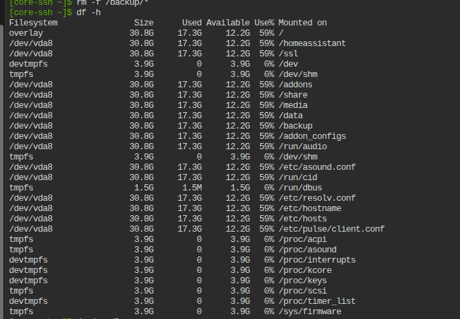

  <h1 align="center">SmartChain</h1>
  
Мультипровайдерный LLM-ассистент для Home Assistant

## Обзор

SmartChain — кастомная интеграция Home Assistant, предоставляющая интеллектуального голосового/текстового ассистента на базе нескольких LLM-провайдеров через LangChain. Помимо диалогового ассистента, интеграция включает встроенную AI-панель для генерации, редактирования и деплоя автоматизаций прямо из текстового описания.

Поддерживаемые провайдеры:

- **GigaChat** (Сбер) — русскоязычная модель с поддержкой vision
- **YandexGPT** — LLM от Яндекса
- **OpenAI** — GPT-4.1, GPT-4o, o3, o4-mini
- **Ollama** — локальные модели (Llama, Qwen, Gemma, T-Pro, DeepSeek, Home-3B)
- **DeepSeek** — самый доступный облачный провайдер (V3, R1)
- **Anthropic** — Claude (Sonnet, Haiku, Opus)

### Возможности

**Диалоговый ассистент**
- **6 LLM-провайдеров** — облачные и локальные, переключение без потери конфигурации
- **Несколько агентов** — разные модели и промпты на одном провайдере (sub-entries)
- **Потоковые ответы** — токен за токеном в реальном времени
- **Управление устройствами** — Assist API (tool calling): свет, розетки, замки, климат
- **Мульти-агент** — делегирование задач между агентами
- **История состояний** — LLM анализирует прошлые события и тренды
- **MCP-серверы** — подключение внешних инструментов через Model Context Protocol
- **Распознавание изображений** — анализ камер через мультимодальные модели
- **Система навыков** — загружаемые YAML-файлы с дополнительными знаниями
- **Кэширование промптов** — экономия токенов на повторных запросах
- **История диалогов** — многоходовые разговоры с контекстом
- **Jinja2-шаблоны** — настраиваемый системный промпт с контекстом устройств

**Сервисы**
- **`smartchain.ask`** — отправить сообщение LLM из автоматизации (Telegram, Slack и др.)
- **`smartchain.analyze_image`** — снимок с камеры → мультимодальный LLM → ответ
- **`smartchain.generate_automation`** — текстовое описание → YAML автоматизации/скрипта/сцены/blueprint
- **`smartchain.deploy_automation`** — деплой сгенерированного YAML в конфигурацию HA
- **`smartchain.list_yaml`** — список существующих автоматизаций, скриптов, сцен или blueprint
- **`smartchain.get_yaml`** — получить YAML-исходник любого существующего элемента HA
- **AI Task** — генерация структурированных данных в автоматизациях

**Панель SmartChain AI**
- Боковая панель с вкладками «Генерация» и «Анализ камеры»
- Создание автоматизаций, скриптов, сцен и blueprint из текстового описания
- Редактирование и улучшение существующего YAML с помощью AI
- Встроенный выбор сущностей и агента
- Валидация YAML (структура, entity ID, сервисы) перед деплоем
- Просмотр и загрузка существующих элементов HA в редактор

## Установка

### Требования
- Home Assistant 2024.12.0+
- [HACS](https://hacs.xyz/)

### Установка через HACS
1. Добавьте репозиторий как [пользовательский HACS репозиторий](https://hacs.xyz/docs/faq/custom_repositories): `https://github.com/dzerik/ha-smartchain`
2. Найдите "SmartChain" в HACS
3. Установите и перезапустите Home Assistant

## Быстрый старт

### 1. Добавление интеграции
**Настройки > Устройства и службы > Добавить интеграцию > SmartChain**

### 2. Выбор провайдера и ввод ключа

| Провайдер | Что нужно |
|-----------|----------|
| GigaChat | Авторизационные данные с [developers.sber.ru](https://developers.sber.ru/studio) |
| YandexGPT | API-ключ + Folder ID из [Yandex Cloud](https://cloud.yandex.com) |
| OpenAI | API-ключ с [platform.openai.com](https://platform.openai.com/account/api-keys) |
| Ollama | Адрес сервера (по умолчанию: `http://localhost:11434`) |
| DeepSeek | API-ключ с [platform.deepseek.com](https://platform.deepseek.com) |
| Anthropic | API-ключ с [console.anthropic.com](https://console.anthropic.com) |

### 3. Настройка параметров
- **Модель** — выбор из списка или ввод произвольного имени
- **Assist API** — включите для управления устройствами через LLM
- **Системный промпт** — настройте поведение ассистента
- **История состояний** — включите для анализа прошлых событий

### 4. Активация ассистента
**Настройки > Голосовые ассистенты > Добавить** — выберите SmartChain как conversation agent.

### 5. Открытие панели SmartChain AI
Нажмите **SmartChain AI** в боковой панели Home Assistant для доступа к панели генерации автоматизаций.

## Документация

Подробное руководство по всем возможностям:
**[docs/USER_GUIDE.md](docs/USER_GUIDE.md)**

Темы:
- Несколько агентов и мульти-агент
- Управление устройствами (Assist API)
- История состояний
- MCP-серверы
- Распознавание изображений
- Система навыков (YAML)
- Панель SmartChain AI (генерация автоматизаций, анализ камер)
- Сервис `smartchain.ask` (Telegram, Slack)
- Сервис `smartchain.analyze_image`
- Сервис `smartchain.generate_automation`
- Деплой и валидация сгенерированного YAML
- Редактирование и улучшение существующих автоматизаций
- AI Task для автоматизаций
- Настройка промптов
- Справочник параметров и моделей

## Лицензия

MIT
