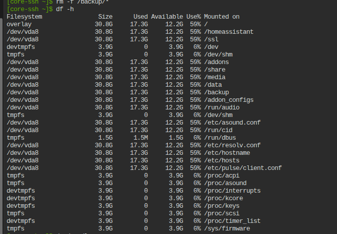

  <h1 align="center">SmartChain</h1>
  
Мультипровайдерный LLM-ассистент для Home Assistant

## Обзор

SmartChain — кастомная интеграция Home Assistant, предоставляющая интеллектуального голосового/текстового ассистента на базе нескольких LLM-провайдеров через LangChain. Помимо диалогового ассистента, интеграция включает встроенную AI-панель для генерации, редактирования и деплоя автоматизаций прямо из текстового описания.

Поддерживаемые провайдеры:

**Облачные:**
- **GigaChat** (Сбер) — русскоязычная модель с поддержкой vision
- **YandexGPT** — LLM от Яндекса
- **OpenAI** — GPT-4.1, GPT-4o, o3, o4-mini
- **Anthropic** — Claude (Sonnet, Haiku, Opus)
- **DeepSeek** — самый доступный облачный провайдер (V3, R1)
- **OpenRouter** *(v5.0.0+)* — единый API с маршрутизацией на сотни облачных моделей
- **Groq** *(v5.0.0+)* — быстрый инференс open-weight моделей
- **Together** *(v5.0.0+)* — облачный хостинг open-weight моделей

**Локальные:**
- **Ollama** — локальные модели (Llama, Qwen, Gemma, T-Pro, DeepSeek, Home-3B)
- **LM Studio** *(v5.0.0+)* — локальный OpenAI-совместимый сервер, API-ключ не нужен
- **llama.cpp** *(v5.0.0+)* — локальный OpenAI-совместимый сервер, API-ключ не нужен

Все провайдеры, кроме GigaChat, YandexGPT, Ollama и Anthropic, работают через OpenAI-совместимый API, и base URL у каждого из них можно изменить — в том числе у OpenAI и DeepSeek, адрес которых раньше был задан жёстко. Так запросы можно направить на зеркало, прокси или собственный шлюз. На существующие конфигурации это не влияет: значения по умолчанию прежние.

Эмбеддинги для долговременной памяти и индекса сущностей доступны у GigaChat, YandexGPT, OpenAI, Ollama, Together, LM Studio и llama.cpp — у OpenRouter и Groq API эмбеддингов нет.

### Возможности

**Диалоговый ассистент**
- **11 LLM-провайдеров** — облачные и локальные, переключение без потери конфигурации
- **Несколько агентов** — разные модели и промпты на одном провайдере (sub-entries)
- **Потоковые ответы** — токен за токеном в реальном времени
- **Управление устройствами** — Assist API (tool calling): свет, розетки, замки, климат
- **Мульти-агент оркестрация** *(v4.4.0+)* — `ask_agents` параллельный fan-out до 5 sibling-агентов, `critique_response` ревью второго мнения, `ask_agent` одиночная делегация
- **Свои tools в YAML** *(v4.1.0+)* — декларативные LLM-инструменты с четырьмя типами действий (`service`, `template`, `rest`, `script`); per-subentry фильтр `allowed_tools`
- **MCP-клиент** *(v4.2.0+)* — подключение к удалённым MCP-серверам (`stdio` / `sse` / `http`) — filesystem, GitHub, brave-search и др.; автореконнект с exponential backoff
- **Долговременная память / RAG** *(v4.3.0+, переработано в v5.0.0)* — именованные хранилища памяти на четырёх подключаемых векторных бэкендах (`sqlite_numpy` — по умолчанию, без доустановки — плюс `sqlite_vec`, `pgvector`, `qdrant`); эмбеддинги настраиваются как sub-entry провайдера (GigaChat / YandexGPT / OpenAI / Ollama), поэтому креды не живут в YAML; встроенный tool `search_memory`; ингест диалогов + (опционально) HA logbook
- **Индекс сущностей** *(v5.0.0+)* — нацельте хранилище на дом, а не на диалог, и оно станет семантическим индексом ваших сущностей: четыре пресета охвата (`minimal` / `optimal` / `maximal` / `paranoid`) плюс переопределения `include` / `exclude`; tool `search_entities` находит устройство по описанию (*«что варит кофе»*), сливая лексический и векторный поиск, поэтому продолжает работать при упавшем провайдере эмбеддингов; обходы инкрементальны, так что перезапуск не эмбеддит ничего заново
- **Динамический контекст сущностей** *(v5.0.0+, **включено по умолчанию**)* — системный промпт перестаёт возить все сущности с их состояниями на каждом ходу. Вместо этого он несёт компактный скелет дома (по строке на область, имена сгруппированы по доменам) плюс блок на каждый ход с теми сущностями, о которых сообщение на самом деле, — с их `entity_id` и живыми состояниями. Охват задаётся собственным пресетом (`dynamic_context_preset`); **индекс сущностей не нужен** — лексический поиск работает по одним реестрам, а настроенный индекс добавляет сверху семантический. На пути Assist выключено по умолчанию, включается через `dynamic_context_on_assist`; один флажок (`dynamic_entity_context`) возвращает старый полный дамп
- **История состояний** — tool `get_state_history` для прошлых состояний устройств
- **Распознавание изображений** — анализ камер через мультимодальные модели
- **Система навыков** — загружаемые YAML-файлы с дополнительными знаниями
- **Кэширование промптов** — экономия токенов на повторных запросах
- **История диалогов** — многоходовые разговоры с контекстом
- **Jinja2-шаблоны** — настраиваемый системный промпт с контекстом устройств

**Сервисы**
- **`smartchain.ask`** — отправить сообщение LLM из автоматизации (Telegram, Slack и др.)
- **`smartchain.analyze_image`** — снимок с камеры → мультимодальный LLM → ответ
- **`smartchain.reload_tools`** *(v4.1.0+)* — перечитать `tools.yaml`, перезапустить MCP-соединения, атомарно пересобрать память
- **`smartchain.clear_memory`** *(v4.3.0+)* — удалить сохранённые memories с фильтром по `kind` и/или `agent_id`
- **`smartchain.reindex_entities`** *(v5.0.0+)* — принудительно обойти индекс сущностей; `full: true` эмбеддит всё заново
- **AI Task** — генерация структурированных данных в автоматизациях

**Панель SmartChain AI**
- Боковая панель: вкладки Agents, Embeddings, Stores, Settings, Tools и анализ камеры
- Выбор любой камеры HA и постановка вопроса LLM на естественном языке о снимке
- Результат публикуется в событие `smartchain_image_analyzed` и сенсор `sensor.smartchain_last_analysis`

> **Примечание:** Фича генерации YAML-автоматизаций / скриптов / сцен / blueprint была удалена в v4.0.0. См. [CHANGELOG.md](CHANGELOG.md) для деталей миграции.

## Установка

### Требования
- Home Assistant 2024.12.0+
- [HACS](https://hacs.xyz/)

### Установка через HACS
1. Добавьте репозиторий как [пользовательский HACS репозиторий](https://hacs.xyz/docs/faq/custom_repositories): `https://github.com/dzerik/ha-smartchain`
2. Найдите "SmartChain" в HACS
3. Установите и перезапустите Home Assistant

## Быстрый старт

### 1. Добавление интеграции
**Настройки > Устройства и службы > Добавить интеграцию > SmartChain**

### 2. Выбор провайдера и ввод ключа

| Провайдер | Что нужно |
|-----------|----------|
| GigaChat | Авторизационные данные с [developers.sber.ru](https://developers.sber.ru/studio) |
| YandexGPT | API-ключ + Folder ID из [Yandex Cloud](https://cloud.yandex.com) |
| OpenAI | API-ключ с [platform.openai.com](https://platform.openai.com/account/api-keys) |
| Ollama | Адрес сервера (по умолчанию: `http://localhost:11434`) |
| DeepSeek | API-ключ с [platform.deepseek.com](https://platform.deepseek.com) |
| Anthropic | API-ключ с [console.anthropic.com](https://console.anthropic.com) |
| OpenRouter | API-ключ с [openrouter.ai](https://openrouter.ai) |
| Groq | API-ключ с [console.groq.com](https://console.groq.com) |
| Together | API-ключ с [api.together.xyz](https://api.together.xyz) |
| LM Studio | Адрес сервера (по умолчанию: `http://localhost:1234/v1`) — API-ключ не нужен |
| llama.cpp | Адрес сервера (по умолчанию: `http://localhost:8080/v1`) — API-ключ не нужен |

### 3. Настройка параметров
- **Модель** — выбор из списка или ввод произвольного имени
- **Assist API** — включите для управления устройствами через LLM
- **Системный промпт** — настройте поведение ассистента
- **История состояний** — включите для анализа прошлых событий

### 4. Активация ассистента
**Настройки > Голосовые ассистенты > Добавить** — выберите SmartChain как conversation agent.

### 5. Открытие панели SmartChain AI
Нажмите **SmartChain AI** в боковой панели Home Assistant. Администратору доступны вкладки **Agents**, **Embeddings**, **Stores** (хранилища памяти и векторов, со строкой состояния по каждому), **Settings**, **Tools** (конструктор пользовательских инструментов на форме; tools.yaml остаётся импортом/экспортом) и **Camera**; всем остальным — только Camera.

## Документация

Полное руководство со всеми возможностями и работающими примерами:
- **English:** [docs/USAGE.md](docs/USAGE.md)
- **Русский:** [docs/USAGE-ru.md](docs/USAGE-ru.md)

Темы: провайдеры и креды · опции subentries · все сервисы с примерами · встроенные tools для conversation (Assist API, history, delegate, multi-agent, search_memory, search_entities) · свои tools в YAML (service / template / rest / script) · MCP-клиент (stdio / SSE / HTTP) · долговременная память (4 векторных бэкенда + sub-entry эмбеддингов) · индекс сущностей (пресеты, `include` / `exclude`, приватность) · динамический контекст сущностей (скелет + поиск на каждом ходу) · AI Task · sidebar-панель · система навыков · troubleshooting.

## Что нового

| Версия | Что добавлено |
|---|---|
| **v5.0.0** | Подключаемые векторные бэкенды (sqlite_numpy / sqlite_vec / pgvector / qdrant), эмбеддинги как возможность провайдера, именованные хранилища, индекс сущностей с tool `search_entities`, динамический контекст сущностей в системном промпте (включён по умолчанию, индекс не нужен) |
| v4.4.0 | Multi-agent оркестрация — `ask_agents` параллельный fan-out + `critique_response` ревью второго мнения |
| v4.3.0 | Долговременная память / RAG — Chroma vector store *(заменено в v5.0.0)*, tool `search_memory`, ингест диалогов + logbook |
| v4.2.0 | MCP-клиент — подключение к удалённым MCP-серверам через stdio / SSE / HTTP с автореконнектом |
| v4.1.0 | Свои tools в YAML — декларативные LLM-инструменты (service / template / rest / script) |
| v4.0.2 | Security-фиксы, корректный `Last Analysis` SensorEntity, правильный `integration_type` |
| v4.0.0 | Major-рефакторинг — фокус на conversation, AI Task и vision |

Полный список изменений: [CHANGELOG.md](CHANGELOG.md).
- Справочник параметров и моделей

## Лицензия

MIT
