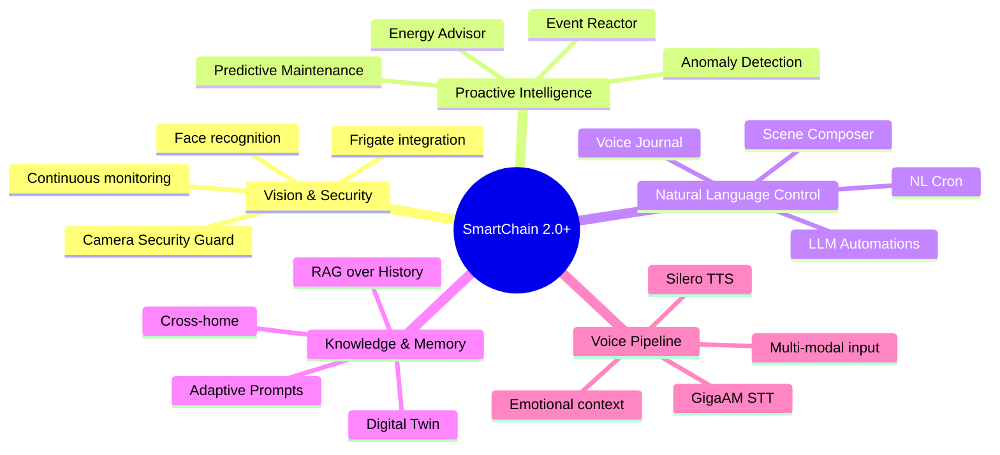

# SmartChain — Конкурентный анализ и точки роста

Дата: 2026-03-11 | Версия: 2.2.0

## Оглавление

1. [Конкуренты — интеграции HA для LLM](#1-конкуренты--интеграции-ha-для-llm)
2. [Что есть у конкурентов, чего нет у нас](#2-что-есть-у-конкурентов-чего-нет-у-нас)
3. [Российские и китайские модели](#3-российские-и-китайские-модели--кого-можно-подключить)
4. [Легковесные локальные модели](#4-легковесные-локальные-модели)
5. [Точки роста: от конкуренции к лидерству](#5-точки-роста-от-конкуренции-к-лидерству)
6. [Стратегическое позиционирование](#6-стратегическое-позиционирование)
7. [Источники](#7-источники)

---

## 1. Конкуренты — интеграции HA для LLM

### Официальные интеграции (встроены в HA core)

| Интеграция | Провайдер | Device Control | AI Task | Streaming | Vision | MCP |
|---|---|---|---|---|---|---|
| OpenAI Conversation | OpenAI | Assist API | да | да | да | да |
| Anthropic | Claude | Assist API | да | да | нет | да |
| Google Gemini | Gemini | Assist API | да | да | да | да |
| Ollama | Локальные | Assist API | да | да | нет | да |
| OpenRouter | 400+ моделей | Assist API | да | да | нет | да |

Все официальные интеграции поддерживают:
- Assist API для управления устройствами
- AI Task entity для генерации данных в автоматизациях
- Sub-entries (несколько агентов с разными моделями через одну интеграцию)
- MCP (Model Context Protocol) для расширения возможностей внешними инструментами
- Streaming ответов
- Conversational follow-ups (LLM может задавать уточняющие вопросы)
- Per-device LLM assignment (разный LLM для разных устройств)

### Custom-интеграции (HACS)

#### Extended OpenAI Conversation (~1.5k stars)
- **Function calling** — вызов сервисов HA через OpenAI API
- **Создание автоматизаций** через естественный язык
- **Чтение истории состояний** — LLM знает, что было раньше
- **Skill-система** — загружаемые навыки из директории
- **Multi-agent** — Dispatcher Agent маршрутизирует запросы

#### YandexGPT (black-roland, 38 stars)
- **YandexART** — генерация изображений
- **Telegram-бот** — использование как backend для Telegram
- **Yandex SpeechKit** — companion-интеграция для STT/TTS

#### Home-LLM (acon96, ~3k stars)
- **Полностью локальный** — никаких облачных сервисов
- **Fine-tuned модели** — Home-3B-v3 (97% точность function calling)
- **CPU-friendly** — работает на Raspberry Pi

#### LLM Vision (~1.5k stars)
- **Мультимодальный** — анализ изображений, видео, live камер, Frigate events
- **Timeline** — хранит историю событий камер
- **Распознавание** — люди, номерные знаки, объекты

#### SmartChain (наш, v2.2.0)
- 6 LLM провайдеров через LangChain (GigaChat, YandexGPT, OpenAI, Ollama, DeepSeek, Anthropic)
- Assist API + tool calling + streaming
- AI Task entity, sub-entries
- Vision: multimodal attachments + `analyze_image` сервис для камер
- `generate_automation` — генерация автоматизаций HA через LLM на естественном языке
- Blueprint: Camera Security Guard (motion → analyze → filter → notify)
- Skill-система, история состояний, multi-agent delegation
- Голосовой пайплайн: GigaAM (STT) + Silero (TTS)
- 123 теста

---

## 2. Что есть у конкурентов, чего нет у нас

### Текущий разрыв (v2.0)

| Фича | Official HA | Extended OpenAI | YandexGPT | Home-LLM | LLM Vision | SmartChain |
|-------|:-----------:|:---------------:|:---------:|:--------:|:----------:|:----------:|
| Assist API / Device Control | + | + | + | + | - | **+** |
| AI Task entity | + | - | - | + | - | **+** |
| Streaming | + | + | - | + | - | **+** |
| Sub-entries | + | - | - | - | - | **+** |
| Ollama / локальные | + | - | - | + | + | **+** |
| Vision (attachments) | + (OpenAI, Gemini) | - | - | - | **+** | **+** |
| Vision (camera service) | - | - | - | - | **+** | **+** |
| MCP | + | - | - | - | - | - |
| Генерация автоматизаций | - | + | - | - | - | **+** |
| Continuous camera monitoring | - | - | - | - | **+** | - |
| Frigate event analysis | - | - | - | - | **+** | - |
| Timeline (история камер) | - | - | - | - | **+** | - |
| RAG / vector search | - | - | - | - | - | - |
| Proactive actions (Event Reactor) | - | - | - | - | - | - |
| Energy optimization | - | - | - | - | - | - |

### Где мы впереди
- **6 провайдеров** в одной интеграции (больше всех)
- **Российские LLM** (GigaChat + YandexGPT) — уникально
- **LangChain экосистема** — легко добавлять новых провайдеров
- **Skill-система** + **multi-agent delegation**
- **Голосовой пайплайн** на русском (GigaAM + Silero)

### Где отстаём
- **MCP** — есть у всех official, нет у нас
- **Continuous camera monitoring** — LLM Vision делает это лучше (timeline, Frigate events)
- **Proactive intelligence** — нет ни у кого, но это будущее

---

## 3. Российские и китайские модели — кого можно подключить

### Российские модели с API

#### GigaChat 2.0 (Сбер) — подключён
- Линейка: Lite / Pro / MAX
- Контекст: до 128K токенов
- Мультимодальность: да (GigaChat 2.0) — **работает с analyze_image**
- Генерация изображений: да (Kandinsky)
- 1M бесплатных токенов/месяц для разработчиков

#### YandexGPT 4 / Alice AI LLM (Яндекс) — подключён
- Контекст: до 32K токенов
- YandexART (генерация изображений), SpeechKit (STT/TTS)

#### T-Pro 2.0 (Т-Банк) — через Ollama
- 32B параметров, Apache 2.0
- Лидер MERA, ruMMLU для русского
- На 30% экономичнее Qwen3 на русском

#### Cotype Pro 2.5 (MTS AI) — enterprise API
- Лидер MERA среди российских LLM
- Агентные навыки: в 10 раз эффективнее предыдущей версии

### Китайские модели

#### DeepSeek V3 / R1 — подключён
- Самый дешёвый cloud-провайдер ($0.14/1M input tokens)
- V3: general-purpose; R1: reasoning

#### Qwen 3 (Alibaba) — через Ollama
- От 0.6B до 235B параметров
- Самая скачиваемая серия на HuggingFace

---

## 4. Легковесные локальные модели

| Модель | Параметры | RAM | Язык | Vision | Особенности |
|---|---|---|---|---|---|
| Home-3B-v3 | 3B | ~2GB | EN | нет | 97% точность HA function calling |
| T-Lite | 7B | ~4GB | RU | нет | Лучшая для русского в 7B классе |
| T-Pro 2.0 | 32B | ~18GB | RU | нет | Лидер русских бенчмарков |
| Qwen3 | 0.6B-4B | 0.5-3GB | RU/EN/ZH | нет | Reasoning, tool calling |
| **LLaVA** | **7B** | **~4GB** | **EN** | **да** | **Vision — анализ камер** |
| **Gemma 3** | **4B** | **~3GB** | **EN** | **да** | **Vision + чат** |
| Phi-4-mini | 3.8B | ~2GB | EN | нет | Microsoft, компактная |
| DeepSeek R1 Distill | 1.5B-14B | 1-8GB | EN/ZH | нет | Reasoning |

Все доступны через **Ollama** — единый backend для self-hosted LLM.

---

## 5. Точки роста: от конкуренции к лидерству

### Tier S — Высокий WOW, реализуемо сейчас

#### Camera Security Guard
Frigate/камера детектит движение → `analyze_image` → LLM анализирует → умное уведомление.
- Фильтрация: кот vs незнакомец
- Полностью локально через Ollama + LLaVA
- Blueprint автоматизации для пользователей
- **Конкурент:** LLM Vision уже это умеет. Наше преимущество — интеграция с Assist API (и уведомление, и действие)

#### LLM-generated Automations
"Включай кофемашину в 7:00 по будням, если я дома" → LLM генерирует YAML → деплой через HA API.
- **Конкурент:** Extended OpenAI. Наше преимущество — работает с любым из 6 провайдеров

#### Voice Journal / Home Diary
"Что было, пока меня не было?" → агрегированный отчёт на основе событий, камер, сенсоров.
- Нет ни у кого. Простая реализация через history tool + промпт.

### Tier A — Уникальные фичи, нет у конкурентов

#### RAG over Home History
ChromaDB/FAISS + embeddings → семантический поиск по годам событий.
"Когда последний раз протекал кран?" — не за 24 часа, а за всю историю.

#### Event Reactor (Проактивный дом)
LLM подписан на события HA, сам решает что делать. Нет ни у кого.
Это принципиально другой подход: не "пользователь → LLM → действие", а "событие → LLM → решение → действие/уведомление".

#### Anomaly Detection
Фоновый анализ паттернов: "Стиралка обычно работает 1 час, сегодня 3 — зависла?"
Notification fatigue reducer: LLM фильтрует шум уведомлений.

#### Energy Advisor
Energy dashboard + тарифы + погода → оптимизация потребления.
Для солнечных панелей: когда продавать/запасать энергию.

### Tier B — Долгосрочные moonshots

#### Ambient Intelligence Daemon
LLM как постоянный фоновый процесс с полным контекстом дома.
Не conversation agent, а "дух дома" — наблюдает, учится, предлагает.

#### Digital Twin
Цифровая модель дома. Симуляция сценариев: "Если отключат отопление?"

#### Predictive Maintenance
Тренды сенсоров → предсказание поломок → напоминания в календаре.

---

## 6. Стратегическое позиционирование

### УТП (Unique Selling Proposition) v2.2

SmartChain — **единственная** HA интеграция, которая:
1. Объединяет **6 LLM провайдеров** (включая российские) в одном компоненте
2. Поддерживает **полный vision pipeline** (камера → LLM → действие) через сервис
3. **Генерирует автоматизации HA** на естественном языке через любого LLM-провайдера
4. Имеет **русскоязычный голосовой пайплайн** (GigaAM STT + Silero TTS)
5. Работает через **LangChain** — легко добавлять новых провайдеров и возможности

### Сильные стороны
- Мультипровайдерность (6 in 1)
- Российские LLM (GigaChat + YandexGPT) без VPN
- Полный голосовой пайплайн на русском
- Vision сервис для камер
- LangChain экосистема (RAG, agents, tools)

### Стратегические направления

### Целевая аудитория

1. **Российские пользователи HA** — GigaChat + YandexGPT + русский STT/TTS
2. **Security-focused** — анализ камер без облака (Ollama + LLaVA)
3. **Privacy-conscious** — полностью локальное решение
4. **Power users** — LangChain экосистема для кастомизации
5. **Energy-conscious** — оптимизация потребления через AI

---

## 7. Источники

### Официальная документация HA
- https://www.home-assistant.io/blog/2025/09/11/ai-in-home-assistant/
- https://developers.home-assistant.io/docs/core/llm/
- https://www.home-assistant.io/integrations/openai_conversation/
- https://www.home-assistant.io/integrations/anthropic/
- https://www.home-assistant.io/integrations/google_generative_ai_conversation/
- https://www.home-assistant.io/integrations/ollama/
- https://www.home-assistant.io/integrations/open_router/
- https://www.home-assistant.io/integrations/ai_task/

### Custom-интеграции
- https://github.com/jekalmin/extended_openai_conversation
- https://github.com/black-roland/homeassistant-yandexgpt
- https://github.com/black-roland/homeassistant-cloud-ru-ai
- https://github.com/acon96/home-llm
- https://github.com/valentinfrlch/ha-llmvision

### Российские LLM
- https://vc.ru/ai/2733649-rossiyskie-neuroseti-2026-modeli-i-servisy-dlya-biznesa
- https://habr.com/ru/companies/tbank/articles/928956/
- https://mts.ai/tech/mts-ai-releases-cotype-pro-2-second-generation-business-focused-llm/

### Speech
- https://github.com/salute-developers/GigaAM (STT)
- https://github.com/Navatusein/Silero-TTS-Service (TTS)
- https://github.com/yusinv/wyoming-gigaam (Wyoming wrapper)
