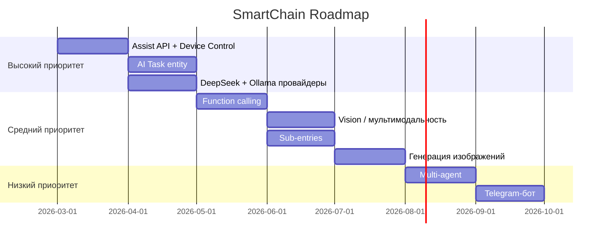

# SmartChain — Конкурентный анализ и точки роста

Дата: 2026-03-10 | Версия: 0.9.0

## Оглавление

1. [Конкуренты — интеграции HA для LLM](#1-конкуренты--интеграции-ha-для-llm)
2. [Что есть у конкурентов, чего нет у нас](#2-что-есть-у-конкурентов-чего-нет-у-нас)
3. [Российские и китайские модели](#3-российские-и-китайские-модели--кого-можно-подключить)
4. [Легковесные локальные модели](#4-легковесные-локальные-модели)
5. [Точки роста и пути развития](#5-точки-роста-и-пути-развития)
6. [Стратегическое позиционирование](#6-стратегическое-позиционирование)
7. [Источники](#7-источники)

---

## 1. Конкуренты — интеграции HA для LLM

### Официальные интеграции (встроены в HA core)

| Интеграция | Провайдер | Device Control | AI Task | Streaming | Vision | MCP |
|---|---|---|---|---|---|---|
| OpenAI Conversation | OpenAI | Assist API | да | да | да | да |
| Anthropic | Claude | Assist API | да | да | нет | да |
| Google Gemini | Gemini | Assist API | да | да | да | да |
| Ollama | Локальные | Assist API | да | да | нет | да |
| OpenRouter | 400+ моделей | Assist API | да | да | нет | да |

Все официальные интеграции поддерживают:
- Assist API для управления устройствами
- AI Task entity для генерации данных в автоматизациях
- Sub-entries (несколько агентов с разными моделями через одну интеграцию)
- MCP (Model Context Protocol) для расширения возможностей внешними инструментами
- Streaming ответов
- Conversational follow-ups (LLM может задавать уточняющие вопросы)
- Per-device LLM assignment (разный LLM для разных устройств)

### Custom-интеграции (HACS)

#### Extended OpenAI Conversation (~1.5k stars)
- GitHub: https://github.com/jekalmin/extended_openai_conversation
- **Function calling** — вызов сервисов HA через OpenAI API
- **Создание автоматизаций** через естественный язык
- **Чтение истории состояний** — LLM знает, что было раньше
- **REST API** — запросы к внешним API
- **Веб-скрейпинг** — получение данных с веб-страниц
- **Skill-система** — загружаемые навыки из директории
- **Multi-agent** — Dispatcher Agent маршрутизирует запросы между специализированными агентами
- **Attach Username** — персонализация по имени пользователя
- Поддержка native functions: `execute_service`, `add_automation`, `get_history`

#### YandexGPT (black-roland, 38 stars)
- GitHub: https://github.com/black-roland/homeassistant-yandexgpt
- **Управление устройствами** — включение/выключение света, регулировка температуры, запуск скриптов
- **YandexART** — генерация изображений
- **Telegram-бот** — использование как backend для Telegram
- **Yandex SpeechKit** — companion-интеграция для STT/TTS
- Последний релиз: v1.5.5 (декабрь 2025)
- Лицензия: MPL-2.0

#### Cloud.ru Foundation Models (black-roland, новый)
- GitHub: https://github.com/black-roland/homeassistant-cloud-ru-ai
- **Открытые модели**: GPT-OSS-120b, Qwen3, Llama, DeepSeek R1 Distill, GLM-4.5, T-Pro
- **Управление устройствами** — полный контроль через чат
- Основан на официальной интеграции OpenAI HA
- Лицензия: Apache 2.0

#### Home-LLM (acon96, ~3k stars)
- GitHub: https://github.com/acon96/home-llm
- **Полностью локальный** — никаких облачных сервисов
- **Fine-tuned модели** — Home-3B-v3 (97% точность function calling), Home-1B-v3
- **Tool calling** — переписан для поддержки agentic tool use loop
- **AI Task entity** — генерация данных для автоматизаций
- **Multi-language** — EN, DE, FR, ES, PL
- **CPU-friendly** — работает на Raspberry Pi
- Backends: Ollama, llama.cpp, OpenAI-compatible API

#### LLM Vision (~1.5k stars)
- GitHub: https://github.com/valentinfrlch/ha-llmvision
- **Мультимодальный** — анализ изображений, видео, live камер, Frigate events
- **Timeline** — хранит историю событий камер
- **Распознавание** — люди, номерные знаки, объекты
- **Голосовые запросы** — "Была ли активность во дворе вчера?"
- Провайдеры: OpenAI, Anthropic, Gemini, Ollama, OpenRouter, и др.

#### SmartChain (наш, 15 stars)
- GigaChat + YandexGPT + OpenAI через LangChain
- Streaming ответов
- ChatLog для истории
- Builtin sentence processor
- Системный промпт с Jinja2

---

## 2. Что есть у конкурентов, чего нет у нас

### Критические отставания

| Фича | У кого есть | Описание |
|---|---|---|
| Управление устройствами (Assist API) | Все official, Extended OpenAI, YandexGPT, Cloud.ru | LLM может включать свет, менять температуру, запускать сценарии |
| AI Task entity | Все official, Home-LLM | Генерация данных для автоматизаций через `ai_task.generate_data` |
| MCP (Model Context Protocol) | Все official | Расширение возможностей агента внешними инструментами |
| Function calling / вызов сервисов | Extended OpenAI, все official | LLM вызывает произвольные сервисы HA |
| Vision / мультимодальность | OpenAI, Gemini, LLM Vision | Анализ камер и изображений |
| Генерация изображений | YandexGPT (YandexART) | Создание изображений по описанию |
| Создание автоматизаций через AI | Extended OpenAI | Генерация автоматизаций HA из естественного языка |
| Доступ к истории состояний | Extended OpenAI | LLM анализирует тренды и прошлые события |

### Менее критичные

| Фича | У кого есть |
|---|---|
| Multi-agent (Dispatcher + специализированные) | Extended OpenAI |
| Skill-система (загружаемые навыки) | Extended OpenAI |
| Telegram-бот | YandexGPT |
| STT/TTS от того же провайдера | YandexGPT + SpeechKit |
| Prompt caching | llama.cpp custom-conversation |
| Sub-entries (несколько агентов) | Все official (HA 2025.8+) |
| Conversational follow-ups | Все official |
| Per-device LLM assignment | Все official |

---

## 3. Российские и китайские модели — кого можно подключить

### Российские модели с API

#### GigaChat 2.0 (Сбер) — уже подключён
- Линейка: Lite / Pro / MAX
- Контекст: до 128K токенов
- Мультимодальность: да (GigaChat 2.0)
- Генерация изображений: да (Kandinsky)
- Цена: ~650 руб/1M токенов (MAX), 1M бесплатных токенов/месяц для разработчиков
- LangChain: `langchain-gigachat` (подключён)
- Function calling: поддерживается

#### YandexGPT 4 / Alice AI LLM (Яндекс) — уже подключён
- Линейка: Lite / Pro
- Контекст: до 32K токенов (до 60 страниц)
- Цена: ~1220 руб/1M токенов (Pro)
- LangChain: `langchain_community.chat_models.ChatYandexGPT` (подключён)
- Доп. сервисы: YandexART (генерация изображений), SpeechKit (STT/TTS)
- Примечание: в октябре 2025 переименован в Alice AI LLM

#### T-Pro 2.0 (Т-Банк / Т-Технологии) — НЕ подключён
- Параметры: 32B
- Лицензия: Apache 2.0 (полностью открытая)
- Гибридный reasoning (быстрые ответы + многошаговое рассуждение)
- На 30% экономичнее Qwen3 и DeepSeek R1-Distil на русском
- Лидер бенчмарков MERA, ruMMLU, ruArena Hard для русского
- Основана на Qwen3 32B с улучшенным кириллическим токенизатором
- Доступ: HuggingFace, self-hosted через Ollama/vLLM
- **Рекомендация: подключить через Ollama backend**

#### T-Lite (Т-Банк) — НЕ подключён
- Параметры: 7B
- Лицензия: Apache 2.0
- Компактная модель для устройств со средней производительностью
- Доступ: HuggingFace, Ollama
- **Рекомендация: подключить через Ollama как легковесную опцию**

#### Cotype Pro 2.5 (MTS AI / MWS AI) — НЕ подключён
- Лидер среди российских LLM в бенчмарке MERA
- Агентные навыки: в 10 раз эффективнее Cotype Pro 2
- Превосходит Qwen3-32B на 22% по точности на русском
- Доступ: enterprise API (MWS Cloud)
- **Рекомендация: рассмотреть при наличии API**

#### Cotype Nano (MTS AI) — НЕ подключён
- Открытая модель, работает на мобильных устройствах и ноутбуках
- Лучшие результаты в своём классе на Ru Arena Hard
- **Рекомендация: подключить через Ollama**

### Китайские модели (доступны из России)

#### DeepSeek V3 / R1 — НЕ подключён
- V3: general-purpose, tool calling, structured output
- R1: reasoning, chain-of-thought
- LangChain: `langchain-deepseek` (`ChatDeepSeek`)
- Цена: самая низкая на рынке (~$0.14/1M input tokens)
- Доступ из РФ: API (возможны проблемы с блокировкой IP Роскомнадзором), self-hosted через Ollama
- **Рекомендация: подключить как самый дешёвый cloud-провайдер**

#### Qwen 3 (Alibaba) — НЕ подключён
- Модели от 0.6B до 235B параметров
- Самая скачиваемая серия моделей на HuggingFace (2025-2026)
- Reasoning mode, tool calling
- LangChain: `ChatOllama` или Cloud.ru
- **Рекомендация: подключить через Ollama backend**

#### GLM-4.5 (Zhipu AI) — НЕ подключён
- Доступ: Cloud.ru Foundation Models
- **Рекомендация: подключить через Cloud.ru или Ollama**

#### Baichuan, Yi, MiniCPM — НЕ подключены
- Open-source, self-hosted через Ollama
- **Рекомендация: автоматически доступны при поддержке Ollama**

---

## 4. Легковесные локальные модели

Для пользователей без мощного GPU или с Raspberry Pi:

| Модель | Параметры | RAM | Язык | Особенности |
|---|---|---|---|---|
| Home-3B-v3 | 3B | ~2GB | EN/DE/FR/ES | 97% точность function calling HA |
| Home-1B-v3 | 1B | ~1GB | EN | Raspberry Pi compatible |
| T-Lite | 7B | ~4GB | RU | лучшая для русского в классе 7B |
| T-Pro 2.0 | 32B | ~18GB | RU | лидер русскоязычных бенчмарков |
| Qwen3 | 0.6B-4B | 0.5-3GB | RU/EN/ZH | reasoning, tool calling |
| Phi-4-mini | 3.8B | ~2GB | EN | Microsoft, компактная |
| Gemma 3 | 1B-4B | 1-3GB | EN | Google, vision support |
| DeepSeek R1 Distill | 1.5B-14B | 1-8GB | EN/ZH | reasoning |
| Cotype Nano | small | ~2GB | RU | MTS AI, открытая |
| MiniCPM | 1.2B-8B | 1-4GB | ZH/EN | OpenBMB, компактная |

Все локальные модели доступны через **Ollama** — единый backend для self-hosted LLM.

---

## 5. Точки роста и пути развития

### Приоритет: Высокий (конкурентный паритет)

#### 5.1 Управление устройствами через Assist API
- **Что:** Использовать `chat_log.async_provide_llm_data()` для доступа к HA tools
- **Зачем:** Главная фича, которую имеют ВСЕ конкуренты. Без неё SmartChain — только чат-бот, не smart home agent
- **Как:** HA LLM API предоставляет intents для управления exposed entities. Нужно передать tools в LLM и обработать tool calls
- **Сложность:** Средняя. GigaChat и DeepSeek поддерживают function calling. Паттерн задокументирован в HA developer docs

#### 5.2 AI Task entity
- **Что:** Добавить `AITaskEntity` с методом `_async_generate_data()`
- **Зачем:** Позволит использовать SmartChain в автоматизациях, скриптах, шаблонах через `ai_task.generate_data`
- **Как:** Новый entity наряду с ConversationEntity, может разделять общую логику обработки chat_log
- **Сложность:** Низкая-средняя

#### 5.3 Новые провайдеры LLM
- **DeepSeek** (`pip install langchain-deepseek`) — `ChatDeepSeek`, самый дешёвый, tool calling
- **Ollama** (`pip install langchain-ollama`) — `ChatOllama`, все локальные модели (T-Pro, Qwen, Llama, DeepSeek)
- **Anthropic** (`pip install langchain-anthropic`) — `ChatAnthropic`, extended thinking
- **Зачем:** Расширение аудитории, поддержка локальных моделей, снижение стоимости
- **Сложность:** Низкая — архитектура через LangChain уже позволяет добавлять провайдеров в `client_util.py`

### Приоритет: Средний (дифференциация)

#### 5.4 Function calling / вызов сервисов HA
- **Что:** LLM вызывает произвольные сервисы HA (свет, климат, сценарии)
- **Зачем:** Extended OpenAI Conversation — самая популярная custom-интеграция именно из-за этой фичи
- **Как:** Определить tool specs для `execute_service`, `get_history`, передавать в LLM, обрабатывать tool calls в цикле
- **Сложность:** Средняя-высокая

#### 5.5 Vision / мультимодальность
- **Что:** Анализ изображений с камер через LLM
- **Зачем:** GigaChat 2.0 поддерживает мультимодальность. Можно анализировать камеры без LLM Vision
- **Как:** Передавать изображения как attachments в LLM запрос
- **Сложность:** Средняя

#### 5.6 Генерация изображений
- **Что:** GigaChat (Kandinsky) и YandexART для создания изображений
- **Зачем:** Уникальная фича для российского рынка. У конкурента YandexGPT уже есть
- **Как:** Отдельный сервис или entity для генерации
- **Сложность:** Средняя

#### 5.7 Sub-entries (несколько агентов)
- **Что:** Позволить создавать несколько conversation agents с разными моделями/промптами через одну интеграцию
- **Зачем:** Паттерн из HA 2025.8+. Один агент для чата, другой для device control, третий для генерации
- **Сложность:** Средняя

#### 5.8 MCP (Model Context Protocol)
- **Что:** Интеграция с MCP серверами для расширения возможностей агента
- **Зачем:** Все official-интеграции поддерживают. Даёт доступ к новостям, todo-спискам, внешним данным
- **Сложность:** Средняя-высокая

### Приоритет: Низкий (nice to have)

#### 5.9 Доступ к истории состояний
- LLM анализирует тренды и прошлые события ("Какая была температура вчера?")

#### 5.10 Telegram-бот
- Использовать SmartChain как backend для Telegram (как у YandexGPT)

#### 5.11 STT/TTS интеграция
- Связка с Yandex SpeechKit или GigaChat TTS для полного voice pipeline на русском

#### 5.12 Prompt caching
- Кэширование промптов для ускорения повторных запросов (как в llama.cpp)

#### 5.13 Multi-agent
- Dispatcher agent маршрутизирует запросы между специализированными агентами

#### 5.14 Skill-система
- Загружаемые "навыки" для разных доменов (погода, расписание, рецепты)

#### 5.15 Conversational follow-ups
- LLM задаёт уточняющие вопросы, HA слушает ответ

---

## 6. Стратегическое позиционирование

### Текущее УТП (Unique Selling Proposition)

SmartChain — **единственная** HA интеграция, объединяющая GigaChat + YandexGPT + OpenAI в одном компоненте через LangChain. Это позволяет:
- Переключаться между провайдерами без переустановки
- Использовать единый интерфейс для разных LLM
- Легко добавлять новые модели через LangChain экосистему

### Слабые стороны

- Нет управления устройствами — главный разрыв с конкурентами
- Нет AI Task — не может использоваться в автоматизациях
- Нет локальных моделей (Ollama) — зависимость от cloud API
- Небольшое сообщество (15 stars vs 3k у Home-LLM)

### Рекомендуемая дорожная карта

### Целевая аудитория

1. **Российские пользователи HA** — GigaChat + YandexGPT без VPN
2. **Privacy-conscious** — Ollama + T-Pro/Qwen для полностью локального решения
3. **Мультипровайдерные** — один компонент вместо нескольких интеграций
4. **Разработчики** — LangChain экосистема для кастомизации

---

## 7. Источники

### Официальная документация HA
- https://www.home-assistant.io/blog/2025/09/11/ai-in-home-assistant/
- https://developers.home-assistant.io/docs/core/llm/
- https://www.home-assistant.io/integrations/openai_conversation/
- https://www.home-assistant.io/integrations/anthropic/
- https://www.home-assistant.io/integrations/google_generative_ai_conversation/
- https://www.home-assistant.io/integrations/ollama/
- https://www.home-assistant.io/integrations/open_router/
- https://www.home-assistant.io/integrations/ai_task/
- https://www.home-assistant.io/blog/2025/08/06/release-20258/
- https://developers.home-assistant.io/docs/core/entity/ai-task/
- https://developers.home-assistant.io/docs/core/entity/conversation

### Custom-интеграции
- https://github.com/jekalmin/extended_openai_conversation
- https://github.com/black-roland/homeassistant-yandexgpt
- https://github.com/black-roland/homeassistant-cloud-ru-ai
- https://github.com/acon96/home-llm
- https://github.com/valentinfrlch/ha-llmvision

### Российские LLM
- https://vc.ru/ai/2733649-rossiyskie-neuroseti-2026-modeli-i-servisy-dlya-biznesa
- https://habr.com/ru/companies/tbank/articles/928956/
- https://mts.ai/tech/mts-ai-releases-cotype-pro-2-second-generation-business-focused-llm/
- https://www.tbank.ru/about/news/11122024-the-t-technologies-group-has-introduced-the-worlds-most-efficient-open-large-language-models-in-russian/

### Китайские LLM
- https://intuitionlabs.ai/articles/chinese-open-source-llms-2025
- https://changelog.langchain.com/announcements/deepseek-integration-in-langchain
- https://www.index.dev/blog/chinese-ai-models-deepseek

### LangChain интеграции
- https://docs.langchain.com/oss/python/integrations/providers/yandex
- https://docs.langchain.com/oss/python/integrations/chat/deepseek
- https://ollama.com/fixt/home-3b-v3
