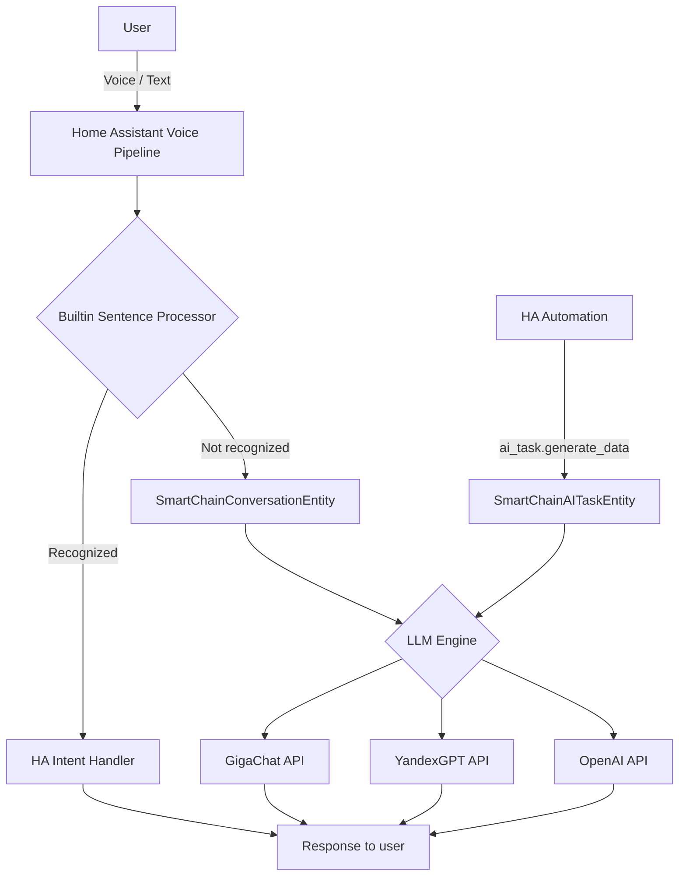
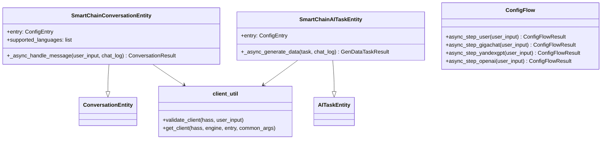
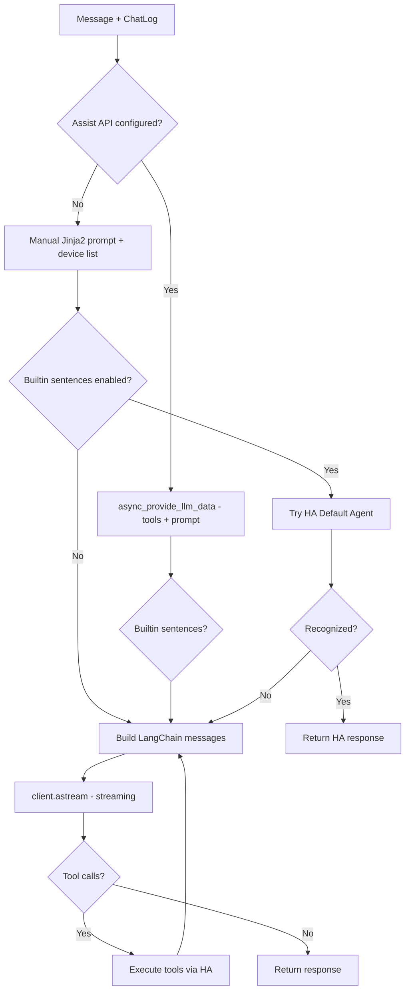

# SmartChain — Technical Documentation

## Overview

**SmartChain** is a custom component for [Home Assistant](https://www.home-assistant.io/) providing a voice/conversation assistant using multiple LLM providers via LangChain.

- **Version:** 0.7.0
- **Domain:** `smartchain`
- **Integration type:** service
- **IoT class:** cloud_polling
- **Distribution:** [HACS](https://hacs.xyz/)

## Architecture



### Key Components



## File Structure

```
ha-smartchain/
├── custom_components/
│   └── smartchain/
│       ├── __init__.py          # Entry setup/unload, platform registration
│       ├── conversation.py      # ConversationEntity (streaming, tool calling)
│       ├── ai_task.py           # AITaskEntity (data generation)
│       ├── config_flow.py       # Config Flow + Options Flow
│       ├── client_util.py       # LLM client factory + validation
│       ├── const.py             # Constants, prompts, model lists
│       ├── manifest.json        # Integration metadata
│       ├── strings.json         # Base localization strings
│       └── translations/
│           ├── en.json          # English localization
│           └── ru.json          # Russian localization
├── tests/
│   ├── conftest.py              # Fixtures (hass, mock LLM client)
│   ├── test_config_flow.py      # Config Flow tests (11)
│   ├── test_init.py             # Conversation entity tests (19)
│   ├── test_ai_task.py          # AI Task entity tests (7)
│   └── test_setup.py            # Setup/unload tests (4)
├── docs/
│   ├── DOCUMENTATION.md         # This file
│   ├── COMPETITIVE_ANALYSIS.md  # Competitive analysis
│   └── ROADMAP.md               # Development roadmap
├── CLAUDE.md                    # Project rules for Claude Code
├── CHANGELOG.md                 # Version changelog
├── TODO.md                      # Task checklist
├── README.md / README-ru.md     # User documentation (EN/RU)
├── pytest.ini                   # Pytest configuration
├── requirements_test.txt        # Test dependencies
├── hacs.json                    # HACS metadata
└── LICENSE                      # MIT license
```

## Supported LLM Providers

| Provider      | ID          | Client Class                           | Auth Parameters          |
| ------------- | ----------- | -------------------------------------- | ------------------------ |
| **GigaChat**  | `gigachat`  | `GigaChat` (langchain-gigachat)        | `credentials`            |
| **YandexGPT** | `yandexgpt` | `ChatYandexGPT` (langchain-community)  | `api_key` + `folder_id`  |
| **OpenAI**    | `openai`    | `ChatOpenAI` (langchain-openai)        | `openai_api_key`         |

### Available Models

- **GigaChat:** GigaChat, GigaChat:latest, GigaChat-Plus, GigaChat-Pro, GigaChat-Max
- **YandexGPT:** YandexGPT, YandexGPT Lite, Summary
- **OpenAI:** gpt-4.1, gpt-4.1-mini, gpt-4.1-nano, gpt-4o, gpt-4o-mini, o3, o3-mini, o4-mini

Custom model names are also supported.

## Conversation Flow



### Streaming
Responses stream token-by-token via `ChatLog.async_add_delta_content_stream()`. The `_async_langchain_stream()` generator converts LangChain `AIMessageChunk` to HA delta dicts.

### Tool Calling (Assist API)
When `llm_hass_api` is configured, HA tools (lights, switches, etc.) are converted to LangChain format via `_ha_tool_to_dict()` and bound to the client with `bind_tools()`. The tool calling loop runs up to `MAX_TOOL_ITERATIONS = 10` times.

### AI Task Entity
`SmartChainAITaskEntity` implements `ai_task.AITaskEntity` for use in automations via `ai_task.generate_data`. Supports:
- Plain text generation
- Structured output (JSON parsing with `task.structure`)
- Tool calling (same as conversation entity)

## Configuration Parameters

### Data (set during installation)

| Parameter | Key         | Type  | Description                              |
| --------- | ----------- | ----- | ---------------------------------------- |
| Engine    | `engine`    | `str` | LLM engine ID                            |
| API Key   | `api_key`   | `str` | Authentication key                       |
| Folder ID | `folder_id` | `str` | Yandex Cloud folder (YandexGPT only)     |

### Options (configurable after installation)

| Parameter              | Key                        | Type       | Default  | Description                          |
| ---------------------- | -------------------------- | ---------- | -------- | ------------------------------------ |
| Model (list)           | `model`                    | `str`      | `""`     | Model from provider list             |
| Model (custom)         | `model_user`               | `str`      | `""`     | Custom model name                    |
| Assist API             | `llm_hass_api`             | `list`     | -        | HA LLM API for device control        |
| Prompt                 | `prompt`                   | `template` | Default  | System prompt (Jinja2)               |
| Temperature            | `temperature`              | `float`    | `0.1`    | Generation temperature               |
| Max Tokens             | `max_tokens`               | `int`      | -        | Max response tokens                  |
| Builtin Sentences      | `process_builtin_sentences`| `bool`     | `True`   | Try HA builtin handler first         |
| Chat History           | `chat_history`             | `bool`     | `True`   | Keep conversation history            |
| Profanity              | `profanity`                | `bool`     | `False`  | Profanity filter (GigaChat only)     |
| Verify SSL             | `verify_ssl`               | `bool`     | `False`  | SSL cert verification (GigaChat)     |

## Testing

```bash
pip install pytest-homeassistant-custom-component
python3 -m pytest tests/ -v
```

### Test Coverage (41 tests)

- **test_config_flow.py** — 11 tests (engine selection, full flows, error handling, skip validation)
- **test_init.py** — 19 tests (conversation entity, streaming, tool calling, history, prompts)
- **test_ai_task.py** — 7 tests (data generation, structured output, errors, tools)
- **test_setup.py** — 4 tests (setup, unload, entity creation)

## Dependencies

| Package                    | Description                    |
| -------------------------- | ------------------------------ |
| `home-assistant-intents`   | Language support               |
| `langchain-gigachat>=0.3.0`| GigaChat LLM client           |
| `langchain-openai>=0.3.0`  | OpenAI LLM client             |
| `langchain-community>=0.4.0`| YandexGPT + LangChain utils  |
| `yandexcloud==0.295.0`     | Yandex Cloud SDK              |

HA dependencies: `ai_task`, `conversation`
