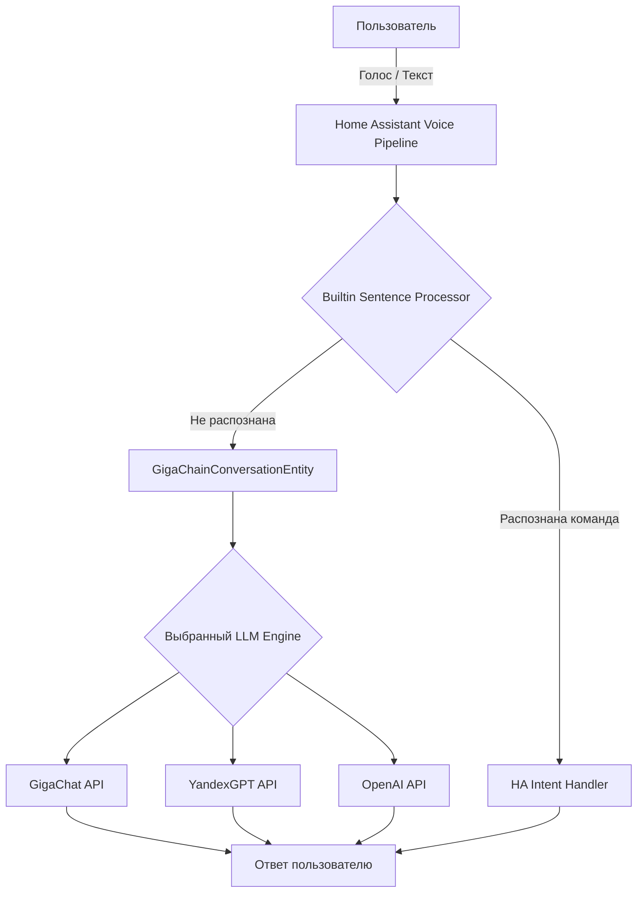
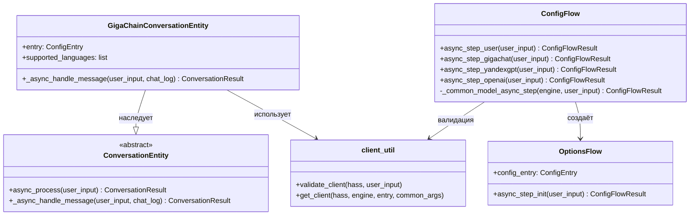
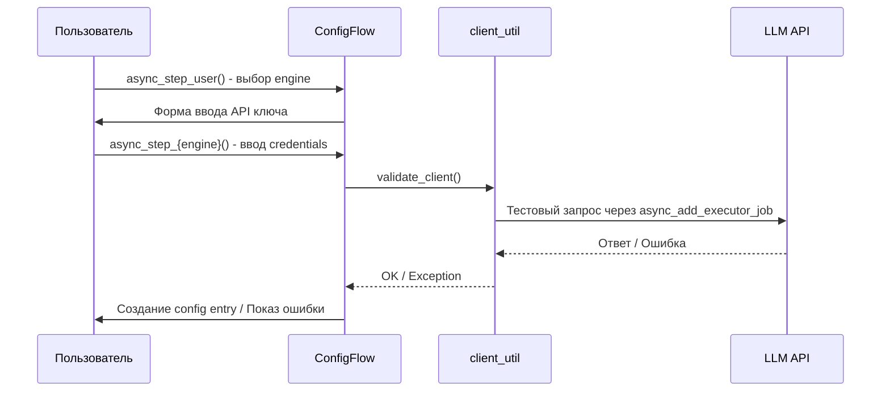
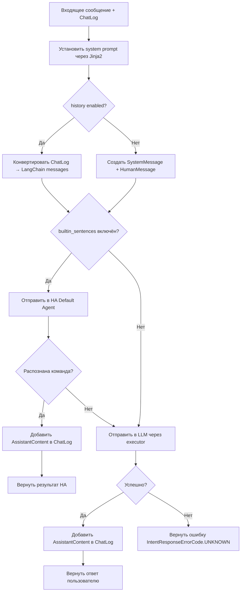

# GigaChain — Техническая документация

## Оглавление

1. [Обзор проекта](#обзор-проекта)
2. [Архитектура](#архитектура)
3. [Структура файлов](#структура-файлов)
4. [Поддерживаемые LLM](#поддерживаемые-llm)
5. [Поток конфигурации](#поток-конфигурации)
6. [Обработка диалогов](#обработка-диалогов)
7. [Конфигурационные параметры](#конфигурационные-параметры)
8. [Тестирование](#тестирование)
9. [CI/CD и инструменты качества](#cicd-и-инструменты-качества)
10. [Зависимости](#зависимости)
11. [Changelog](#changelog)
12. [Оставшиеся рекомендации](#оставшиеся-рекомендации)

---

## Обзор проекта

**GigaChain** — это custom component (интеграция) для [Home Assistant](https://www.home-assistant.io/), реализующая голосового/диалогового ассистента с использованием больших языковых моделей (LLM) через фреймворк LangChain.

- **Версия:** 0.5.0
- **Тип интеграции:** service (`integration_type: "service"`)
- **IoT-класс:** cloud_polling
- **Распространение:** через [HACS](https://hacs.xyz/) (Home Assistant Community Store)
- **Автор:** [@gritaro](https://github.com/gritaro)

---

## Архитектура

Интеграция реализует `ConversationEntity` из Home Assistant, что позволяет использовать LLM в качестве entity-based backend-а для голосового ассистента HA с поддержкой `ChatLog` API.



### Ключевые компоненты



### Хранение данных

Клиент LLM хранится в `entry.runtime_data` (согласно best practices HA), а не в `hass.data[DOMAIN]`. Это обеспечивает автоматическую очистку при unload.

### Управление историей (ChatLog)

С v0.4.0 история диалогов полностью управляется нативным `ChatLog` Home Assistant. Собственный `OrderedDict` удалён. `ConversationEntity` автоматически получает `chat_log` в `_async_handle_message` — HA управляет сессиями и историей через `chat_session`.

Конвертация ChatLog в LangChain messages выполняется функцией `_chatlog_to_langchain()`:
- `SystemContent` → `SystemMessage`
- `UserContent` → `HumanMessage`
- `AssistantContent` → `AIMessage`

---

## Структура файлов

```
gigachain/
├── custom_components/
│   └── gigachain/
│       ├── __init__.py          # Основной модуль: setup/unload entry
│       ├── conversation.py      # ConversationEntity (основная логика агента)
│       ├── config_flow.py       # Config Flow и Options Flow для UI настройки
│       ├── client_util.py       # Фабрика LLM-клиентов и валидация подключения
│       ├── const.py             # Константы, модели, дефолтный промпт
│       ├── manifest.json        # Метаданные интеграции для HA
│       ├── strings.json         # Строки локализации (en, базовые)
│       └── translations/
│           ├── en.json          # Английская локализация
│           └── ru.json          # Русская локализация
├── tests/
│   ├── __init__.py              # Пакет тестов
│   ├── conftest.py              # Фикстуры (hass, mock LLM client)
│   ├── test_config_flow.py      # Тесты Config Flow (11 тестов)
│   ├── test_init.py             # Тесты ConversationEntity (11 тестов)
│   └── test_setup.py            # Тесты setup/unload (4 теста)
├── static/                      # Изображения для README
├── .github/
│   ├── workflows/
│   │   ├── push.yml             # CI на push в main (lint + test)
│   │   ├── pull.yml             # CI на pull request (lint + test)
│   │   └── cron.yaml            # Ежедневная валидация
│   ├── CODEOWNERS
│   ├── settings.yml             # Настройки GitHub репозитория
│   └── dependabot.yaml          # Автообновление зависимостей
├── docs/
│   └── DOCUMENTATION.md         # Техническая документация (этот файл)
├── pytest.ini                   # Конфигурация pytest
├── .pre-commit-config.yaml      # Pre-commit hooks (ruff)
├── hacs.json                    # HACS metadata
├── CHANGELOG.md                 # Список изменений по версиям
├── LICENSE                      # MIT лицензия
├── requirements.txt             # (пустой)
├── requirements_test.txt        # pytest-homeassistant-custom-component
├── README.md                    # Документация (EN)
└── README-ru.md                 # Документация (RU)
```

---

## Поддерживаемые LLM

| Engine       | ID          | Статус  | Класс клиента                          | Параметры аутентификации       |
| ------------ | ----------- | ------- | -------------------------------------- | ------------------------------ |
| **GigaChat** | `gigachat`  | Активен | `GigaChat` (langchain-gigachat)        | `credentials` (auth data)      |
| **YandexGPT**| `yandexgpt` | Активен | `ChatYandexGPT` (langchain-community)  | `api_key` + `folder_id`        |
| **OpenAI**   | `openai`    | Активен | `ChatOpenAI` (langchain-openai)        | `openai_api_key`               |

### Доступные модели

- **GigaChat:** GigaChat, GigaChat:latest, GigaChat-Plus, GigaChat-Pro, GigaChat-Max
- **YandexGPT:** YandexGPT, YandexGPT Lite, Summary
- **OpenAI:** gpt-4o, gpt-4o-mini, gpt-4-turbo, gpt-4, gpt-3.5-turbo, o1, o1-mini, o3-mini

Пользователь также может ввести произвольное имя модели в поле "Custom Model Name".

---

## Поток конфигурации

### Первоначальная настройка (Config Flow)



### Изменение опций (Options Flow)

Пользователь может настроить:
- Выбор модели из списка или ввод пользовательского имени модели
- Системный промпт (шаблон Jinja2 HA)
- Температуру генерации (0.0 - 1.0, шаг 0.05)
- Максимум токенов
- Использование встроенного HA командного процессора
- Историю чата
- Цензуру (только для GigaChat)
- Проверку SSL (только для GigaChat)

---

## Обработка диалогов

### Алгоритм `_async_handle_message`



### Управление историей

История полностью управляется нативным `ChatLog` Home Assistant. При включённой опции `chat_history` весь ChatLog конвертируется в LangChain messages через `_chatlog_to_langchain()`. При отключённой — в LLM отправляются только system prompt и текущее сообщение.

### Streaming (v0.5.0)

Ответы LLM передаются потоково через `ChatLog.async_add_delta_content_stream()`. Async генератор `_async_langchain_stream()` конвертирует `AIMessageChunk` от LangChain `client.astream()` в HA delta dicts (`{"role": "assistant", "content": "..."}`).

### Системный промпт

По умолчанию промпт настраивает модель как HAL 9000 и включает информацию об устройствах и зонах Home Assistant через Jinja2-шаблоны.

Доступные переменные шаблона:
- `ha_name` - название установки Home Assistant
- `areas()` - список зон
- `area_devices(area)` - устройства в зоне
- `device_attr(device, attr)` - атрибуты устройства

---

## Конфигурационные параметры

### Данные интеграции (data) - задаются при установке

| Параметр  | Ключ        | Тип   | Описание                                        |
| --------- | ----------- | ----- | ----------------------------------------------- |
| Engine    | `engine`    | `str` | ID LLM engine (gigachat, yandexgpt, openai)     |
| API Key   | `api_key`   | `str` | Ключ аутентификации                              |
| Folder ID | `folder_id` | `str` | ID каталога Yandex Cloud (только YandexGPT)      |

### Опции (options) - настраиваются после установки

| Параметр                   | Ключ                       | Тип        | По умолчанию    | Описание                                    |
| -------------------------- | -------------------------- | ---------- | --------------- | ------------------------------------------- |
| Модель (из списка)         | `model`                    | `str`      | `""`            | Модель из предложенного списка               |
| Модель (пользовательская)  | `model_user`               | `str`      | `""`            | Произвольное имя модели                      |
| Промпт                     | `prompt`                   | `template` | HAL 9000 prompt | Системный промпт (Jinja2)                    |
| Температура                | `temperature`              | `float`    | `0.1`           | Температура генерации                        |
| Макс. токенов              | `max_tokens`               | `int`      | -               | Максимум токенов в ответе                    |
| HA процессор               | `process_builtin_sentences`| `bool`     | `True`          | Сначала пробовать встроенный HA обработчик    |
| История чата               | `chat_history`             | `bool`     | `True`          | Сохранять историю диалога                    |
| Цензура                    | `profanity`                | `bool`     | `False`         | Фильтр ненорматива (только GigaChat)         |
| Проверка SSL               | `verify_ssl`               | `bool`     | `False`         | Проверка SSL сертификатов (только GigaChat)   |

---

## Тестирование

### Запуск тестов

```bash
pip install pytest-homeassistant-custom-component
python3 -m pytest tests/ -v
```

### Покрытие (29 тестов)

**`tests/test_config_flow.py`** — 11 тестов:
- Отображение формы выбора engine (user step)
- Выбор каждого engine → показ соответствующей формы (3 теста)
- Полный flow для GigaChat, YandexGPT, OpenAI (3 теста)
- Обработка ошибок: `ConnectError`, `ResponseError`, неизвестная ошибка (3 теста)
- Skip validation (1 тест)

**`tests/test_init.py`** — 14 тестов:
- Базовый запрос к LLM через `_async_handle_message` (streaming)
- Установка system prompt в ChatLog
- Отправка корректных messages в LLM
- Сохранение истории диалога (system + human + ai) через ChatLog
- Отключение истории (`chat_history: False`)
- Обработка ошибок LLM (graceful error response)
- Делегирование в builtin HA agent (не распознано → LLM)
- Делегирование в builtin HA agent (распознано → HA response)
- `supported_languages` возвращает непустой список
- `_attr_supports_streaming` включён
- `_chatlog_to_langchain` конвертация (2 теста)
- `_async_langchain_stream` конвертация чанков (2 теста)

**`tests/test_setup.py`** — 4 теста:
- Setup entry для GigaChat
- Setup entry для OpenAI
- Unload entry
- Создание conversation entity при setup

### Фикстуры

- `setup_ha_components` (autouse) — настраивает `homeassistant` и `conversation` компоненты
- `mock_llm_client` — мок LLM клиента с `invoke()` возвращающим `AIMessage`
- `mock_validate_client` — мок валидации для пропуска реальных API вызовов
- `enable_custom_integrations` — включает custom components в тестовом HA

---

## CI/CD и инструменты качества

### GitHub Actions Workflows

| Workflow    | Триггер      | Действия                                                   |
| ----------- | ------------ | ---------------------------------------------------------- |
| `push.yml`  | push в main  | HACS + Hassfest валидация, ruff lint + format, pytest      |
| `pull.yml`  | pull request | HACS + Hassfest валидация, ruff lint + format, pytest      |
| `cron.yaml` | ежедневно    | HACS + Hassfest валидация                                  |

### Pre-commit hooks

- **ruff** (v0.9.7) - линтер + форматирование (заменяет black, isort, flake8)

---

## Зависимости

Определены в `manifest.json`:

| Зависимость                | Описание                                       |
| -------------------------- | ---------------------------------------------- |
| `home-assistant-intents`   | Поддержка языков для conversation agent         |
| `langchain-gigachat>=0.3.0`| GigaChat LLM клиент                            |
| `langchain-openai>=0.3.0`  | OpenAI LLM клиент                              |
| `langchain-community>=0.4.0`| YandexGPT и утилиты LangChain                 |
| `yandexcloud==0.295.0`     | Yandex Cloud SDK                                |

Внутренние зависимости HA: `conversation`

---

## Changelog

Подробный список изменений по версиям — см. [CHANGELOG.md](../CHANGELOG.md).

### Основные вехи

- **v0.5.0** — Streaming ответов LLM через `async_add_delta_content_stream`, 29 тестов
- **v0.4.0** — ChatLog для истории (удалён OrderedDict), миграция на langchain-gigachat/langchain-openai, pytest в CI
- **v0.3.0** — Миграция на ConversationEntity, conversation.py, 20 тестов
- **v0.2.1** — verify_ssl, обновление GitHub Actions, MIT лицензия
- **v0.2.0** — Исправление блокировки event loop, удаление Anyscale, модернизация
- **v0.1.x** — Первоначальные релизы: GigaChat, YandexGPT, OpenAI, Config/Options Flow

---

## Оставшиеся рекомендации

Все рекомендации из предыдущих версий выполнены. Возможные направления развития:

1. **LLM API интеграция** — использовать `chat_log.async_provide_llm_data()` для доступа к HA tools (управление устройствами через LLM)
2. **Миграция ChatYandexGPT** — когда появится отдельный пакет `langchain-yandex`, мигрировать с `langchain_community`
