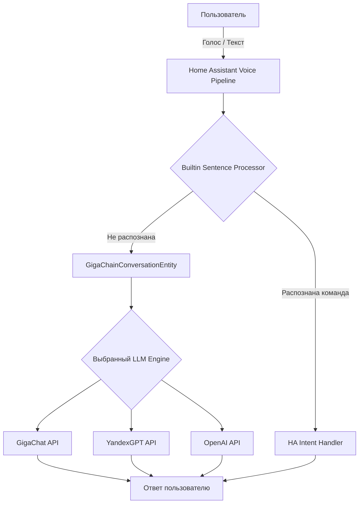
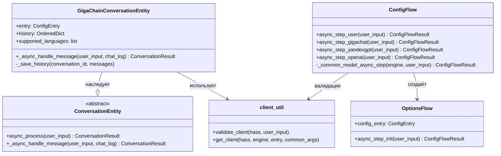
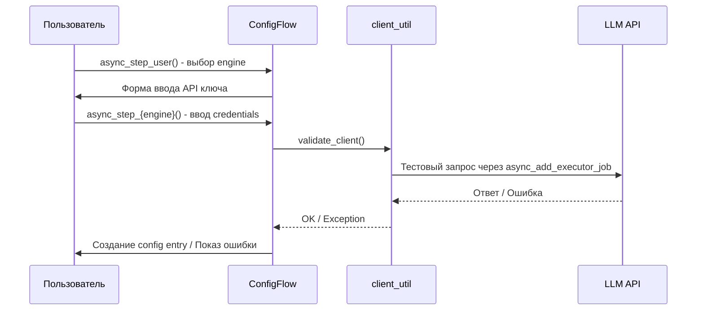
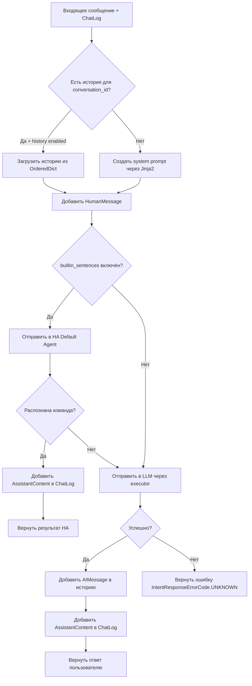

# GigaChain — Техническая документация

## Оглавление

1. [Обзор проекта](#обзор-проекта)
2. [Архитектура](#архитектура)
3. [Структура файлов](#структура-файлов)
4. [Поддерживаемые LLM](#поддерживаемые-llm)
5. [Поток конфигурации](#поток-конфигурации)
6. [Обработка диалогов](#обработка-диалогов)
7. [Конфигурационные параметры](#конфигурационные-параметры)
8. [Тестирование](#тестирование)
9. [CI/CD и инструменты качества](#cicd-и-инструменты-качества)
10. [Зависимости](#зависимости)
11. [Changelog v0.3.0](#changelog-v030)
12. [Changelog v0.2.0](#changelog-v020)
13. [Changelog v0.2.1](#changelog-v021)
14. [Оставшиеся рекомендации](#оставшиеся-рекомендации)

---

## Обзор проекта

**GigaChain** — это custom component (интеграция) для [Home Assistant](https://www.home-assistant.io/), реализующая голосового/диалогового ассистента с использованием больших языковых моделей (LLM) через фреймворк GigaChain (форк LangChain).

- **Версия:** 0.3.0
- **Тип интеграции:** service (`integration_type: "service"`)
- **IoT-класс:** cloud_polling
- **Распространение:** через [HACS](https://hacs.xyz/) (Home Assistant Community Store)
- **Автор:** [@gritaro](https://github.com/gritaro)

---

## Архитектура

Интеграция реализует `ConversationEntity` из Home Assistant (миграция с `AbstractConversationAgent` в v0.3.0), что позволяет использовать LLM в качестве entity-based backend-а для голосового ассистента HA с поддержкой `ChatLog` API.



### Ключевые компоненты



### Хранение данных

Клиент LLM хранится в `entry.runtime_data` (согласно best practices HA), а не в `hass.data[DOMAIN]`. Это обеспечивает автоматическую очистку при unload.

### Entity-based подход (v0.3.0)

В v0.3.0 интеграция мигрировала с `AbstractConversationAgent` на `ConversationEntity`:

- **`__init__.py`** — упрощён до setup/unload через `async_forward_entry_setups` / `async_unload_platforms`
- **`conversation.py`** — новый файл с `GigaChainConversationEntity`, реализующим `_async_handle_message(user_input, chat_log)`
- **`ChatLog`** — HA-управляемый лог диалога, куда entity добавляет `AssistantContent`
- **`Platform.CONVERSATION`** — entity регистрируется как платформа conversation

---

## Структура файлов

```
gigachain/
├── custom_components/
│   └── gigachain/
│       ├── __init__.py          # Основной модуль: setup/unload entry
│       ├── conversation.py      # ConversationEntity (основная логика агента)
│       ├── config_flow.py       # Config Flow и Options Flow для UI настройки
│       ├── client_util.py       # Фабрика LLM-клиентов и валидация подключения
│       ├── const.py             # Константы, модели, дефолтный промпт
│       ├── manifest.json        # Метаданные интеграции для HA
│       ├── strings.json         # Строки локализации (en, базовые)
│       └── translations/
│           ├── en.json          # Английская локализация
│           └── ru.json          # Русская локализация
├── tests/
│   ├── __init__.py              # Пакет тестов
│   ├── conftest.py              # Фикстуры (hass, mock LLM client)
│   ├── test_config_flow.py      # Тесты Config Flow (11 тестов)
│   └── test_init.py             # Тесты ConversationEntity (9 тестов)
├── static/                      # Изображения для README
├── .github/
│   ├── workflows/
│   │   ├── push.yml             # CI на push в main
│   │   ├── pull.yml             # CI на pull request
│   │   └── cron.yaml            # Ежедневная валидация
│   ├── CODEOWNERS
│   ├── settings.yml             # Настройки GitHub репозитория
│   └── dependabot.yaml          # Автообновление зависимостей
├── docs/
│   └── DOCUMENTATION.md         # Техническая документация (этот файл)
├── pytest.ini                   # Конфигурация pytest
├── .pre-commit-config.yaml      # Pre-commit hooks (ruff)
├── hacs.json                    # HACS metadata
├── CHANGELOG.md                 # Список изменений по версиям
├── LICENSE                      # MIT лицензия
├── requirements.txt             # (пустой)
├── requirements_test.txt        # pytest-homeassistant-custom-component
├── README.md                    # Документация (EN)
└── README-ru.md                 # Документация (RU)
```

---

## Поддерживаемые LLM

| Engine       | ID          | Статус  | Класс клиента                        | Параметры аутентификации       |
| ------------ | ----------- | ------- | ------------------------------------ | ------------------------------ |
| **GigaChat** | `gigachat`  | Активен | `GigaChat` (langchain_community)     | `credentials` (auth data)      |
| **YandexGPT**| `yandexgpt` | Активен | `ChatYandexGPT` (langchain_community)| `api_key` + `folder_id`        |
| **OpenAI**   | `openai`    | Активен | `ChatOpenAI` (langchain_community)   | `openai_api_key`               |

### Доступные модели

- **GigaChat:** GigaChat, GigaChat:latest, GigaChat-Plus, GigaChat-Pro, GigaChat-Max
- **YandexGPT:** YandexGPT, YandexGPT Lite, Summary
- **OpenAI:** gpt-4o, gpt-4o-mini, gpt-4-turbo, gpt-4, gpt-3.5-turbo, o1, o1-mini, o3-mini

Пользователь также может ввести произвольное имя модели в поле "Custom Model Name".

---

## Поток конфигурации

### Первоначальная настройка (Config Flow)



### Изменение опций (Options Flow)

Пользователь может настроить:
- Выбор модели из списка или ввод пользовательского имени модели
- Системный промпт (шаблон Jinja2 HA)
- Температуру генерации (0.0 - 1.0, шаг 0.05)
- Максимум токенов
- Использование встроенного HA командного процессора
- Историю чата
- Цензуру (только для GigaChat)
- Проверку SSL (только для GigaChat)

---

## Обработка диалогов

### Алгоритм `_async_handle_message`



### Управление историей

История хранится в `OrderedDict` с лимитом `MAX_HISTORY_CONVERSATIONS = 50` записей. При превышении лимита самые старые записи автоматически удаляются (FIFO). Вызов LLM выполняется через `hass.async_add_executor_job()` + `client.invoke()` для предотвращения блокировки event loop.

### ChatLog интеграция (v0.3.0)

`ConversationEntity` автоматически управляет `ChatLog` — entity получает `chat_log` в `_async_handle_message` и добавляет ответ через:

```python
chat_log.async_add_assistant_content_without_tools(
    AssistantContent(agent_id=user_input.agent_id, content=response_text)
)
```

### Системный промпт

По умолчанию промпт настраивает модель как HAL 9000 и включает информацию об устройствах и зонах Home Assistant через Jinja2-шаблоны.

Доступные переменные шаблона:
- `ha_name` - название установки Home Assistant
- `areas()` - список зон
- `area_devices(area)` - устройства в зоне
- `device_attr(device, attr)` - атрибуты устройства

---

## Конфигурационные параметры

### Данные интеграции (data) - задаются при установке

| Параметр  | Ключ        | Тип   | Описание                                        |
| --------- | ----------- | ----- | ----------------------------------------------- |
| Engine    | `engine`    | `str` | ID LLM engine (gigachat, yandexgpt, openai)     |
| API Key   | `api_key`   | `str` | Ключ аутентификации                              |
| Folder ID | `folder_id` | `str` | ID каталога Yandex Cloud (только YandexGPT)      |

### Опции (options) - настраиваются после установки

| Параметр                   | Ключ                       | Тип        | По умолчанию    | Описание                                    |
| -------------------------- | -------------------------- | ---------- | --------------- | ------------------------------------------- |
| Модель (из списка)         | `model`                    | `str`      | `""`            | Модель из предложенного списка               |
| Модель (пользовательская)  | `model_user`               | `str`      | `""`            | Произвольное имя модели                      |
| Промпт                     | `prompt`                   | `template` | HAL 9000 prompt | Системный промпт (Jinja2)                    |
| Температура                | `temperature`              | `float`    | `0.1`           | Температура генерации                        |
| Макс. токенов              | `max_tokens`               | `int`      | -               | Максимум токенов в ответе                    |
| HA процессор               | `process_builtin_sentences`| `bool`     | `True`          | Сначала пробовать встроенный HA обработчик    |
| История чата               | `chat_history`             | `bool`     | `True`          | Сохранять историю диалога                    |
| Цензура                    | `profanity`                | `bool`     | `False`         | Фильтр ненорматива (только GigaChat)         |
| Проверка SSL               | `verify_ssl`               | `bool`     | `False`         | Проверка SSL сертификатов (только GigaChat)   |

---

## Тестирование

### Запуск тестов

```bash
pip install pytest-homeassistant-custom-component
python3 -m pytest tests/ -v
```

### Покрытие

**`tests/test_config_flow.py`** — 11 тестов:
- Отображение формы выбора engine (user step)
- Выбор каждого engine → показ соответствующей формы (3 теста)
- Полный flow для GigaChat, YandexGPT, OpenAI (3 теста)
- Обработка ошибок: `ConnectError`, `ResponseError`, неизвестная ошибка (3 теста)
- Skip validation (1 тест)

**`tests/test_init.py`** — 9 тестов:
- Базовый запрос к LLM через `_async_handle_message`
- Сохранение истории диалога (system + human + ai)
- Продолжение истории (мультитерновый диалог)
- Отключение истории (`chat_history: False`)
- FIFO-вытеснение при превышении `MAX_HISTORY_CONVERSATIONS`
- Обработка ошибок LLM (graceful error response)
- Делегирование в builtin HA agent (не распознано → LLM)
- Делегирование в builtin HA agent (распознано → HA response)
- `supported_languages` возвращает непустой список

### Фикстуры

- `setup_ha_components` (autouse) — настраивает `homeassistant` и `conversation` компоненты
- `mock_llm_client` — мок LLM клиента с `invoke()` возвращающим `AIMessage`
- `mock_validate_client` — мок валидации для пропуска реальных API вызовов
- `enable_custom_integrations` — включает custom components в тестовом HA

---

## CI/CD и инструменты качества

### GitHub Actions Workflows

| Workflow    | Триггер      | Действия                                          |
| ----------- | ------------ | ------------------------------------------------- |
| `push.yml`  | push в main  | HACS + Hassfest валидация, ruff lint + format      |
| `pull.yml`  | pull request | HACS + Hassfest валидация, ruff lint + format      |
| `cron.yaml` | ежедневно    | HACS + Hassfest валидация                          |

### Pre-commit hooks

- **ruff** (v0.9.7) - линтер + форматирование (заменяет black, isort, flake8)

---

## Зависимости

Определены в `manifest.json`:

| Зависимость                | Описание                                       |
| -------------------------- | ---------------------------------------------- |
| `home-assistant-intents`   | Поддержка языков для conversation agent         |
| `gigachain` (git)          | Форк LangChain от gritaro                       |
| `gigachain-community` (git)| Форк langchain-community от gritaro             |
| `yandexcloud==0.295.0`     | Yandex Cloud SDK                                |

Внутренние зависимости HA: `conversation`

---

## Changelog v0.3.0

### Миграция на ConversationEntity

1. **ConversationEntity** — `GigaChatAI(AbstractConversationAgent)` заменён на `GigaChainConversationEntity(ConversationEntity)` с `_async_handle_message(user_input, chat_log)` API.
2. **ChatLog + AssistantContent** — ответы добавляются в ChatLog через `async_add_assistant_content_without_tools()`.
3. **Platform.CONVERSATION** — entity регистрируется через `async_forward_entry_setups` / `async_unload_platforms`.
4. **`__init__.py` упрощён** — только setup/unload entry, вся логика агента вынесена в `conversation.py`.

### Тестирование

1. **20 тестов** — 11 для Config Flow, 9 для ConversationEntity, с использованием `pytest-homeassistant-custom-component`.
2. **`pytest.ini`** — конфигурация с `asyncio_mode = auto`.
3. **`CHANGELOG.md`** — добавлен на основе git-истории проекта.

---

## Changelog v0.2.0

### Исправлены критические проблемы

1. **Блокирующий вызов LLM** - вызов `_client(messages)` заменён на `await hass.async_add_executor_job(client.invoke, messages)`. Event loop HA больше не блокируется.
2. **Deprecated LangChain API** - `client(messages)` (`__call__`) заменён на `client.invoke(messages)` (актуальный API LangChain).
3. **Утечка памяти** - `dict` заменён на `OrderedDict` с лимитом `MAX_HISTORY_CONVERSATIONS = 50`. Старые записи автоматически удаляются.
4. **Баг модели OpenAI** - `DEFAULT_MODEL[ID_ANYSCALE]` исправлен на `DEFAULT_MODEL[ID_OPENAI]` (`gpt-4o-mini`).

### Удалён мёртвый код

1. **Anyscale полностью удалён** - все константы, модели, импорт `ChatAnyscale`, класс `LocalChatAnyscale`, шаги config flow, записи в translations.

### Модернизация

1. **Imports** - `from langchain.schema import ...` заменён на `from langchain_core.messages import ...`.
2. **HA best practices** - `hass.data[DOMAIN]` заменён на `entry.runtime_data` для хранения LLM-клиента.
3. **Config Flow** - `FlowResult` заменён на `ConfigFlowResult`, добавлены type hints, метод `common_model_async_step` переименован в `_common_model_async_step` (приватный).
4. **Модели обновлены**:
   - GigaChat: добавлен GigaChat-Max
   - OpenAI: gpt-4o, gpt-4o-mini, gpt-4-turbo, o1, o1-mini, o3-mini (удалены устаревшие text-davinci, code-davinci и др.)
   - Модель по умолчанию OpenAI: `gpt-3.5-turbo` -> `gpt-4o-mini`
5. **Пробел-sentinel** - `" "` заменён на `""`, проверки `== " "` заменены на `not model or not model.strip()`.
6. **Логика OptionsFlow** - убрана безусловная ошибка `"unsupported"`.
7. **Pre-commit** - ruff v0.9.7 с ruff-format (заменяет black + isort + ruff).
8. **Валидация** - `validate_client` теперь использует `hass.async_add_executor_job` вместо блокирующего вызова.
9. **Переводы** - русская локализация дополнена (ошибки, skip_validation).

---

## Changelog v0.2.1

1. **SSL настраиваемый** - добавлена опция `verify_ssl` в Options Flow для GigaChat. По умолчанию `False` для обратной совместимости.
2. **GitHub Actions обновлены** - `actions/checkout` v3 -> v4, `actions/setup-python` v4 -> v5, Python 3.10 -> 3.12.
3. **Удалены дублирующие workflows** - `hacs.yaml` и `hassfest.yaml` удалены (уже есть в `push.yml`).
4. **CI lint обновлён** - `black` заменён на `ruff check` + `ruff format --check`.
5. **@callback декоратор** - добавлен к `async_get_options_flow` по best practices HA.
6. **test-model.py удалён** - содержал мёртвый Anyscale код с placeholder ключом.
7. **MIT лицензия добавлена** - файл `LICENSE` в корне репозитория.
8. **Переводы дополнены** - добавлена строка `verify_ssl` в en/ru translations.

---

## Оставшиеся рекомендации

### Приоритет: Средний

1. **Использовать ChatLog для истории** — в текущей реализации history хранится в собственном `OrderedDict`. Можно рассмотреть полный переход на `ChatLog` HA, который уже управляет историей через `chat_session`.
2. **Добавить тесты setup/unload** — интеграционные тесты полного цикла `async_setup_entry` / `async_unload_entry` с `MockConfigEntry`.

### Приоритет: Низкий

1. **Миграция на langchain-gigachat/langchain-openai** — текущие `GigaChat` и `ChatOpenAI` из `langchain_community` deprecated, рекомендуется использовать отдельные пакеты `langchain-gigachat` и `langchain-openai`.
2. **CI: добавить запуск тестов** — в GitHub Actions workflows нет шага `pytest`, только lint и валидация.
3. **Поддержка streaming** — `ConversationEntity` поддерживает `_attr_supports_streaming`, можно реализовать потоковую генерацию ответов.
