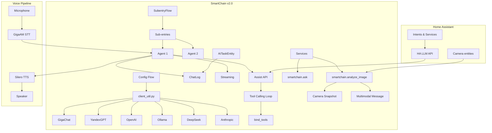
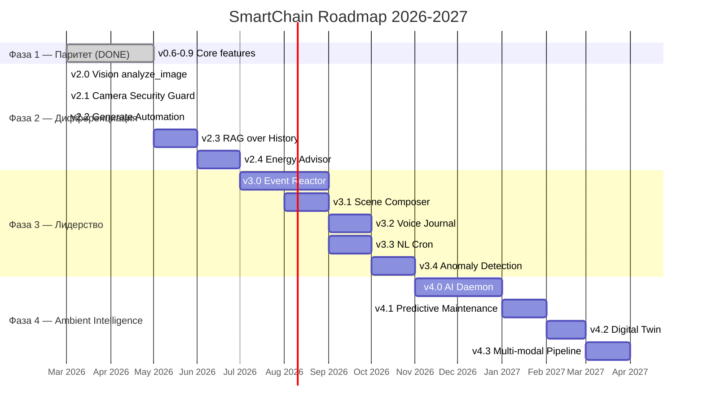

# SmartChain — Дорожная карта развития

Дата: 2026-03-11 | Текущая версия: 2.2.0

## Оглавление

1. [Текущее состояние](#1-текущее-состояние)
2. [Фаза 1 — Конкурентный паритет (DONE)](#2-фаза-1--конкурентный-паритет-done)
3. [Фаза 2 — Дифференциация (IN PROGRESS)](#3-фаза-2--дифференциация-in-progress)
4. [Фаза 3 — Лидерство](#4-фаза-3--лидерство)
5. [Фаза 4 — Ambient Intelligence](#5-фаза-4--ambient-intelligence)
6. [Фаза 5 — Безумные идеи (Moonshots)](#6-фаза-5--безумные-идеи-moonshots)
7. [Технические детали](#7-технические-детали)

---

## 1. Текущее состояние

### Реализовано (v0.1–v2.0)

| Версия | Что сделано |
|--------|-------------|
| 0.1.x | Базовая интеграция: GigaChat + YandexGPT + OpenAI, Config/Options Flow, история диалогов, Jinja2 промпт |
| 0.2.x | Исправления: event loop, deprecated API, verify_ssl, CI (Python 3.12, ruff) |
| 0.3.0 | Миграция на `ConversationEntity` API, `conversation.py`, pytest (20 тестов) |
| 0.4.0 | Миграция на ChatLog, langchain-gigachat/langchain-openai, CI (26 тестов) |
| 0.5.0 | Streaming ответов через `astream()` + `async_add_delta_content_stream()` (29 тестов) |
| 0.6.0 | **Assist API** — управление устройствами через tool calling (34 теста) |
| 0.7.0 | **Переименование GigaChain → SmartChain**, AI Task entity |
| 0.8.0 | **Ollama, DeepSeek, Anthropic** — 6 LLM провайдеров (51 тест) |
| 0.9.0 | **Sub-entries** — множественные агенты на одном провайдере (67 тестов) |
| 1.0–1.5 | Vision (attachments), генерация изображений, MCP, история состояний, multi-agent delegation |
| 1.6–1.8 | Telegram-бот, STT/TTS (GigaAM + Silero), Skill-система, prompt caching |
| 1.9.x | Динамическое получение списка моделей от провайдеров, фиксы GigaChat |
| 2.0.0 | `analyze_image` сервис — анализ камер через LLM, рефакторинг `_find_client` (114 тестов) |
| 2.1.x | GigaChat vision fix (`auto_upload_images=True`), bugfixes |
| **2.2.0** | **`generate_automation` сервис** — генерация автоматизаций через LLM, Blueprint Security Guard (123 теста) |

### Текущая архитектура



---

## 2. Фаза 1 — Конкурентный паритет (DONE)

Все задачи фазы 1 выполнены: Assist API, AI Task, 6 провайдеров, sub-entries.

---

## 3. Фаза 2 — Дифференциация (IN PROGRESS)

### v2.0 — Vision: analyze_image сервис (DONE)

- Сервис `smartchain.analyze_image` — snapshot камеры → multimodal LLM → текстовый ответ
- Поддержка: GigaChat 2.0, OpenAI GPT-4o, Anthropic Claude, Ollama (LLaVA)
- Vision attachments в conversation entity (через ChatLog)
- 3 канала доставки: event, sensor, notify

### v2.1 — Camera Security Guard (DONE)

- Blueprint автоматизации: motion → analyze_image → threat filter → notify
- GigaChat vision fix: `auto_upload_images=True`
- Cooldown для предотвращения спама уведомлений
- Работает полностью локально через Ollama + LLaVA

### v2.2 — LLM-generated Automations (DONE)

- Сервис `smartchain.generate_automation` — описание на естественном языке → YAML
- LLM генерирует валидный YAML автоматизации HA
- Автоматическая очистка markdown code fences из ответа LLM
- Работает с любым из 6 провайдеров

**Пример использования:**
```yaml
service: smartchain.generate_automation
data:
  description: "Каждое утро в 7:00 включи кофемашину, если я дома. По выходным — в 9:00."
response_variable: result
```
Ответ в `result.automation_yaml` — готовый YAML для копирования в automations.yaml.

### v2.3 — RAG over Home History

**Приоритет:** Средний
**Сложность:** Средняя-высокая
**Уникальность:** Нет у конкурентов

**Что:**
- Индексация истории HA в vector store (ChromaDB/FAISS)
- Семантический поиск: "Когда последний раз протекал кран?"
- LLM анализирует тренды за месяцы/годы, а не только последние часы
- Embeddings через тот же LLM провайдер

### v2.4 — Energy Advisor

**Приоритет:** Средний
**Сложность:** Средняя

**Что:**
- LLM анализирует energy dashboard HA + тарифы + прогноз погоды
- Рекомендации: "Включи стиралку через 2 часа — тариф будет дешевле"
- Аномалии: "Потребление на 30% выше обычного — проверьте бойлер"
- Для пользователей с солнечными панелями: когда продавать/запасать энергию

---

## 4. Фаза 3 — Лидерство

### v3.0 — LLM Event Reactor (Проактивный дом)

**Приоритет:** Высокий
**Сложность:** Высокая
**Уникальность:** Нет ни у кого

**Что:**
- LLM подписывается на события HA в реальном времени
- Сам решает, что делать, без команды пользователя
- Работает как фоновый демон с бюджетом действий (чтобы не разориться на токенах)
- Примеры:
  - "Температура в детской упала ниже 20°C и окно открыто — закрыть окно?"
  - "Вы забыли выключить свет в коридоре перед сном"
  - "Датчик протечки сработал — перекрываю воду, отправляю уведомление"

**Реализация:**
- Event bus listener → очередь событий → batch-анализ каждые N секунд
- LLM решает: ignore / notify / act
- Configurable: whitelist событий, бюджет токенов/час, автономность (только notify vs автодействия)

### v3.1 — Scene Composer

**Что:**
- "Создай романтическую атмосферу" → LLM подбирает свет, музыку, температуру, шторы
- Не hardcoded scenes — AI-generated на основе контекста (время, погода, кто дома)
- Обучается на предпочтениях пользователя

### v3.2 — Voice Journal / Home Diary

**Что:**
- "Что происходило, пока меня не было?" → краткий отчёт за день
- LLM агрегирует события: движения, температуры, вызовы сервисов, камеры
- Еженедельный/ежемесячный дайджест

### v3.3 — Natural Language Cron

**Что:**
- "Напомни полить цветы каждую субботу в 10:00"
- "Через 30 минут выключи духовку"
- LLM создаёт HA automation + notification автоматически

### v3.4 — Anomaly Detection as Service

**Что:**
- Фоновый анализ паттернов всех устройств
- "Стиралка обычно работает 1 час, сегодня уже 3 — возможно зависла"
- "Датчик движения в гараже срабатывает каждую ночь в 3:00 — подозрительно"
- Уведомления только при реальных аномалиях (LLM фильтрует шум)

---

## 5. Фаза 4 — Ambient Intelligence

### v4.0 — Ambient Intelligence Daemon ("Дух дома")

**Что:**
- LLM как постоянный фоновый процесс с полным контекстом состояния дома
- Не ждёт команд — наблюдает, анализирует, предлагает
- Персонализация: знает привычки каждого жильца
- Adaptive prompts: сам улучшает свой системный промпт на основе feedback

### v4.1 — Predictive Maintenance

**Что:**
- LLM анализирует тренды и предсказывает поломки
- "Батарея датчика двери — 15%, замените в ближайшие 2 недели"
- "Фильтр кондиционера — время замены (по статистике работы)"
- Интеграция с календарём для напоминаний

### v4.2 — Digital Twin

**Что:**
- LLM строит цифровую модель дома
- Симуляция: "Если добавить тёплый пол, как изменится счёт?"
- "Что будет, если завтра отключат отопление?"
- Сценарий disaster: "При отключении электричества — какие устройства критичны?"

### v4.3 — Multi-modal Input Pipeline

**Что:**
- Одновременный анализ голоса + камеры + сенсоров
- "Посмотри камеру в гараже и скажи, закрыты ли ворота" — голосовая команда → STT → snapshot → LLM → TTS
- Видеоанализ в реальном времени (frame sampling)

---

## 6. Фаза 5 — Безумные идеи (Moonshots)

Эти идеи звучат безумно, но каждая технически осуществима:

### LLM as Zigbee/Z-Wave Debugger
"Почему датчик в ванной не отвечает?" → LLM анализирует mesh-сеть, battery levels, signal strength, last seen — и диагностирует проблему. Умный help desk для умного дома.

### Recipe Assistant (камера + кухня)
Камера на кухне + LLM: "Что приготовить из того, что в холодильнике?" — анализирует содержимое, предлагает рецепты, управляет духовкой через HA.

### Guest Mode
LLM определяет нового человека (через камеру/присутствие) и переключается в guest-friendly режим. Ограниченные команды, приветственное сообщение на нужном языке.

### LLM-powered Presence Detection
Вместо BLE/WiFi — LLM анализирует косвенные признаки (свет включён, движение в комнате, шум, TV) и определяет, кто дома и где.

### Cross-home Management
Один SmartChain агент управляет несколькими домами: "Какая температура на даче?" — запрос к remote HA instance через HA Cloud или VPN.

### Context-Aware Notification Filter
LLM решает, стоит ли отправлять уведомление. Кот прошёл мимо камеры — не отправляю. Незнакомец в 3 ночи — отправляю с приоритетом.

### LLM as HACS Consultant
"Какие интеграции мне установить?" — LLM анализирует конфигурацию HA, установленные устройства и рекомендует подходящие интеграции из HACS.

### LLM Mesh Network
Несколько маленьких LLM на разных устройствах (ESP32-S3, RPi), каждый отвечает за свою зону дома. Центральный координатор на сервере. Минимальная latency для критичных команд.

### Emotional Context
LLM определяет "настроение дома" по паттернам: время суток, активность, музыка, освещение. Адаптирует поведение: утренний режим совы vs жаворонка, вечерний режим "усталость" (приглушённый свет, тихая музыка).

### Dream Mode / Simulation
LLM "спит" ночью и моделирует сценарии: "Что если завтра шторм?" → генерирует pre-emptive automations, проверяет готовность дома.

---

## 7. Технические детали

### Текущие метрики

| Метрика | Значение |
|---------|----------|
| Версия | 2.2.0 |
| Тестов | 123 |
| Провайдеров | 6 |
| Сервисов | 3 (ask, analyze_image, generate_automation) |
| Platforms | CONVERSATION + AI_TASK |

### Целевые метрики по фазам

| Фаза | Версия | Тестов | Ключевая фича |
|-------|--------|--------|---------------|
| Текущая | 2.2.0 | 123 | Vision + Security Guard + Generate Automation |
| Фаза 2 | 2.x | ~140 | RAG + Energy Advisor |
| Фаза 3 | 3.x | ~150 | Event Reactor + Anomaly Detection |
| Фаза 4 | 4.x | ~180 | Ambient Intelligence Daemon |

### Рекомендуемые локальные модели

| Модель | RAM | Лучше всего для | Vision |
|--------|-----|-----------------|--------|
| Home-3B-v3 | ~2GB | Device control (97% точность) | нет |
| T-Lite 7B | ~4GB | Русскоязычный чат | нет |
| T-Pro 2.0 32B | ~18GB | Русский reasoning + tools | нет |
| Qwen3 4B | ~3GB | Мультиязычный + tools | нет |
| LLaVA 7B | ~4GB | **Vision анализ камер** | **да** |
| Gemma 3 4B | ~3GB | Vision + чат (EN) | **да** |

---


