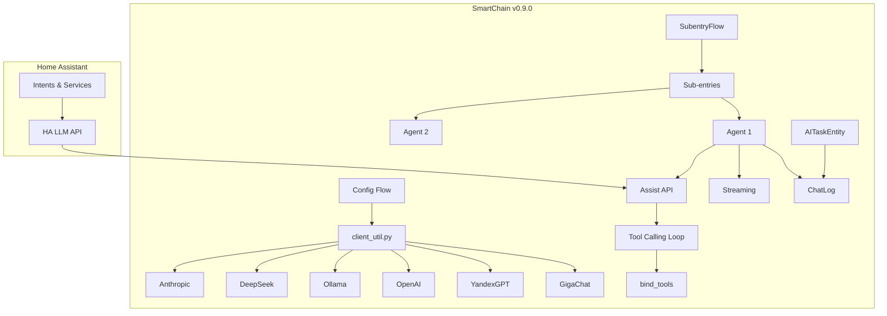
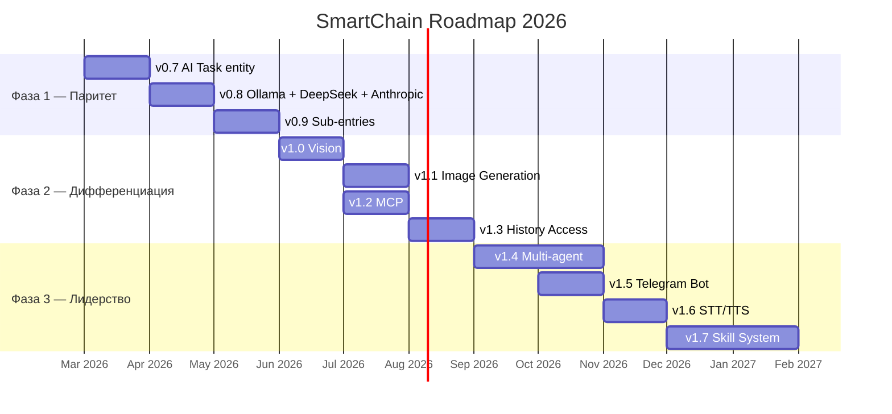

# SmartChain — Дорожная карта развития

Дата: 2026-03-10 | Текущая версия: 0.9.0

## Оглавление

1. [Текущее состояние](#1-текущее-состояние)
2. [Фаза 1 — Конкурентный паритет](#2-фаза-1--конкурентный-паритет-v07--v09)
3. [Фаза 2 — Дифференциация](#3-фаза-2--дифференциация-v10--v13)
4. [Фаза 3 — Лидерство](#4-фаза-3--лидерство-v14)
5. [Технические детали по задачам](#5-технические-детали-по-задачам)

---

## 1. Текущее состояние

### Реализовано (v0.1–v0.6)

| Версия | Что сделано |
|--------|-------------|
| 0.1.x | Базовая интеграция: GigaChat + YandexGPT + OpenAI, Config/Options Flow, история диалогов, Jinja2 промпт |
| 0.2.0 | Исправление блокировки event loop, deprecated API, утечки памяти, удаление Anyscale |
| 0.2.1 | verify_ssl для GigaChat, обновление CI (Python 3.12, ruff) |
| 0.3.0 | Миграция на `ConversationEntity` API, `conversation.py`, pytest (20 тестов) |
| 0.4.0 | Миграция на ChatLog, langchain-gigachat/langchain-openai, CI pytest (26 тестов) |
| 0.5.0 | Streaming ответов через `astream()` + `async_add_delta_content_stream()` (29 тестов) |
| 0.6.0 | **Assist API** — управление устройствами через tool calling, LLM API selector, обновление промпта и моделей (34 теста) |
| 0.7.0 | **Переименование GigaChain → SmartChain**, AI Task entity |
| 0.8.0 | **Ollama, DeepSeek, Anthropic** — 6 LLM провайдеров, 51 тест |
| 0.9.0 | **Sub-entries** — множественные агенты на одном провайдере, ConfigSubentryFlow (67 тестов) |

### Текущая архитектура



### Разрыв с конкурентами

| Фича | Official HA | Extended OpenAI | YandexGPT | Home-LLM | SmartChain |
|-------|:-----------:|:---------------:|:---------:|:--------:|:---------:|
| Assist API / Device Control | + | + | + | + | **+ (v0.6)** |
| AI Task entity | + | - | - | + | **+ (v0.7)** |
| Streaming | + | + | - | + | **+ (v0.5)** |
| MCP | + | - | - | - | - |
| Vision | + (OpenAI, Gemini) | - | - | - | - |
| Генерация изображений | - | - | + | - | - |
| Function calling (custom) | - | + | + | + | - |
| Sub-entries | + | - | - | - | **+ (v0.9)** |
| Ollama / локальные модели | + | - | - | + | **+ (v0.8)** |
| Multi-agent | - | + | - | - | - |
| Telegram-бот | - | - | + | - | - |
| История состояний | - | + | - | - | - |

---

## 2. Фаза 1 — Конкурентный паритет (v0.7 – v0.9)

Цель: закрыть критические разрывы с конкурентами, стать полноценным smart home agent.

### v0.7 — AI Task entity

**Приоритет:** Высокий
**Сложность:** Низкая-средняя
**Зависимости:** нет

**Что:**
- Добавить `AITaskEntity` с методом `_async_generate_data(task, chat_log)`
- Позволяет использовать SmartChain в автоматизациях HA через `ai_task.generate_data`
- Примеры: "Составь план уборки на основе загрязнённости комнат", "Проанализируй расход электричества за неделю"

**Файлы:**
- `custom_components/smartchain/ai_task.py` — новый файл с `SmartChainAITaskEntity`
- `custom_components/smartchain/__init__.py` — добавить `Platform.AI_TASK`
- `custom_components/smartchain/manifest.json` — добавить `"ai_task"` в dependencies
- `tests/test_ai_task.py` — тесты

**Реализация:**
```python
class SmartChainAITaskEntity(AITaskEntity):
    async def _async_generate_data(
        self, task: ai_task.GenData, chat_log: ChatLog
    ) -> None:
        # Предоставить LLM данные (tools, prompt)
        await chat_log.async_provide_llm_data(...)
        # Вызвать LLM через общую логику streaming + tool calling
        # Результат записывается в chat_log автоматически
```

**Референсы:**
- https://developers.home-assistant.io/docs/core/entity/ai-task/
- `homeassistant.components.openai_conversation.ai_task`

---

### v0.8 — Новые провайдеры LLM (Ollama, DeepSeek, Anthropic)

**Приоритет:** Высокий
**Сложность:** Низкая
**Зависимости:** нет

**Что:**
Добавить 3 новых провайдера через LangChain. Архитектура уже позволяет — нужно расширить `client_util.py` и Config Flow.

#### 0.8.1 — Ollama (локальные модели)

Открывает доступ ко всем локальным моделям: T-Pro 2.0, T-Lite, Qwen3, Llama, DeepSeek, Gemma, Phi, Home-3B.

**Файлы:**
- `const.py` — `ID_OLLAMA`, `UNIQUE_ID_OLLAMA`, модели, `CONF_BASE_URL`
- `client_util.py` — `ChatOllama(model=..., base_url=...)`
- `config_flow.py` — шаг `async_step_ollama` (base_url + model)
- `manifest.json` — `langchain-ollama>=0.3.0`
- `strings.json`, `translations/` — строки для Ollama

**Config:**
- `base_url` (по умолчанию `http://localhost:11434`)
- `model` (текстовое поле, т.к. модели загружаются пользователем)

#### 0.8.2 — DeepSeek

Самый дешёвый cloud-провайдер. V3 для обычных задач, R1 для reasoning.

**Файлы:**
- `const.py` — `ID_DEEPSEEK`, модели (`deepseek-chat`, `deepseek-reasoner`)
- `client_util.py` — `ChatDeepSeek(model=..., api_key=...)`
- `config_flow.py` — шаг `async_step_deepseek`
- `manifest.json` — `langchain-deepseek>=0.1.0`

#### 0.8.3 — Anthropic (Claude)

Для пользователей, которые хотят Claude через SmartChain.

**Файлы:**
- `const.py` — `ID_ANTHROPIC`, модели (`claude-sonnet-4-6`, `claude-haiku-4-5`)
- `client_util.py` — `ChatAnthropic(model=..., api_key=...)`
- `config_flow.py` — шаг `async_step_anthropic`
- `manifest.json` — `langchain-anthropic>=0.3.0`

---

### v0.9 — Sub-entries (несколько агентов)

**Приоритет:** Средний-высокий
**Сложность:** Средняя
**Зависимости:** v0.8 (больше пользы с несколькими провайдерами)

**Что:**
- Позволить создавать несколько conversation/AI task agents с разными моделями и промптами через одну интеграцию
- Паттерн из HA 2025.8+ — все официальные интеграции перешли на sub-entries
- Пример: "GigaChat Max для управления домом" + "GigaChat Lite для чата" + "DeepSeek R1 для аналитики"

**Файлы:**
- `config_flow.py` — переработка: корневая entry хранит credentials, sub-entries хранят модель/промпт/API
- `__init__.py` — setup sub-entries
- `conversation.py`, `ai_task.py` — привязка к sub-entry

**Референсы:**
- https://developers.home-assistant.io/docs/config_entries/subentries
- `homeassistant.components.openai_conversation` (реализация через sub-entries)

---

## 3. Фаза 2 — Дифференциация (v1.0 – v1.3)

Цель: добавить уникальные возможности, которых нет у большинства конкурентов.

### v1.0 — Vision / мультимодальность

**Приоритет:** Средний
**Сложность:** Средняя
**Зависимости:** v0.8 (нужны провайдеры с vision: GigaChat 2.0, OpenAI, Ollama)

**Что:**
- Отправка изображений с камер HA в LLM
- Анализ: "Кто у двери?", "Что показывает камера во дворе?"
- Поддержка: GigaChat 2.0 (мультимодальный), OpenAI GPT-4o/4.1, Ollama (LLaVA, Gemma Vision)

**Реализация:**
- Получение snapshot с камеры через `camera.async_get_image()`
- Передача base64 изображения в LLM через LangChain `HumanMessage(content=[{"type": "image_url", ...}])`
- Новый tool `get_camera_snapshot` или интеграция с Frigate events

---

### v1.1 — Генерация изображений (GigaChat Kandinsky + YandexART)

**Приоритет:** Средний
**Сложность:** Средняя
**Зависимости:** нет

**Что:**
- GigaChat 2.0 имеет встроенную генерацию через Kandinsky
- YandexGPT имеет YandexART API
- Результат: `image` entity или сервис `smartchain.generate_image`

**Реализация:**
- Для GigaChat: уже поддерживается через API (модель сама решает, когда генерировать)
- Для YandexART: отдельный API вызов
- Сохранение результата в `/media/` или отправка через notify

---

### v1.2 — MCP (Model Context Protocol)

**Приоритет:** Средний
**Сложность:** Средняя-высокая
**Зависимости:** v0.7 (Assist API)

**Что:**
- Подключение внешних MCP серверов как дополнительных tools для LLM
- Все официальные интеграции HA поддерживают MCP с 2025.8
- Примеры: новости, погода из внешних API, todo-листы, файловая система

**Реализация:**
- HA уже предоставляет MCP tools через `chat_log.llm_api.tools` — если пользователь настроил MCP в HA, tools автоматически доступны через Assist API
- Дополнительно: собственный MCP client для LangChain tools (через `langchain-mcp`)

---

### v1.3 — Доступ к истории состояний

**Приоритет:** Средний
**Сложность:** Средняя
**Зависимости:** v0.7 (tool calling)

**Что:**
- LLM может запрашивать историю состояний entity: "Какая температура была вчера?", "Когда последний раз открывали дверь?"
- У Extended OpenAI Conversation это одна из ключевых фич

**Реализация:**
- Добавить custom tool `get_history(entity_id, start_time, end_time)`
- Использовать `homeassistant.components.recorder` для получения данных
- Форматирование результата в текст для LLM

---

## 4. Фаза 3 — Лидерство (v1.4+)

Цель: уникальные фичи, которых нет ни у кого.

### v1.4 — Multi-agent система

**Приоритет:** Низкий
**Сложность:** Высокая

**Что:**
- Dispatcher Agent маршрутизирует запросы между специализированными агентами
- Агент управления устройствами (дешёвая быстрая модель)
- Агент аналитики (reasoning модель)
- Агент мультимедиа (vision модель)
- Реализация через LangGraph

---

### v1.5 — Telegram-бот

**Приоритет:** Низкий
**Сложность:** Низкая

**Что:**
- Использование SmartChain как backend для Telegram-бота
- Управление домом через Telegram
- Отправка уведомлений с анализом камер

---

### v1.6 — STT/TTS интеграция

**Приоритет:** Низкий
**Сложность:** Средняя

**Что:**
- Связка с Yandex SpeechKit для STT/TTS на русском
- GigaChat TTS (когда появится)
- Полный voice pipeline: микрофон → STT → SmartChain → TTS → динамик

---

### v1.7 — Skill-система

**Приоритет:** Низкий
**Сложность:** Высокая

**Что:**
- Загружаемые "навыки" из директории (как у Extended OpenAI)
- YAML-описание навыка: промпт + tools + trigger
- Маркетплейс навыков (community-driven)

---

### v1.8 — Prompt caching

**Приоритет:** Низкий
**Сложность:** Низкая

**Что:**
- Кэширование системного промпта для ускорения повторных запросов
- Экономия токенов при повторяющихся вызовах
- Реализация: hash промпта → cached response для идентичных запросов

---

## 5. Технические детали по задачам

### Зависимости для новых провайдеров

| Провайдер | pip-пакет | LangChain класс | Min version |
|-----------|-----------|-----------------|-------------|
| Ollama | `langchain-ollama` | `ChatOllama` | >=0.3.0 |
| DeepSeek | `langchain-deepseek` | `ChatDeepSeek` | >=0.1.0 |
| Anthropic | `langchain-anthropic` | `ChatAnthropic` | >=0.3.0 |

### Рекомендуемые локальные модели (для Ollama)

| Модель | RAM | Лучше всего для | Язык |
|--------|-----|-----------------|------|
| Home-3B-v3 | ~2GB | Device control (97% точность) | EN |
| T-Lite 7B | ~4GB | Русскоязычный чат | RU |
| T-Pro 2.0 32B | ~18GB | Русский reasoning, tool calling | RU |
| Qwen3 4B | ~3GB | Мультиязычный, tool calling | RU/EN/ZH |
| Gemma 3 4B | ~3GB | Vision + чат | EN |

### Целевые метрики по фазам

| Фаза | Версия | Тестов | Провайдеров | Ключевая фича |
|-------|--------|--------|-------------|---------------|
| Текущая | 0.8.0 | 51 | 6 | Ollama + DeepSeek + Anthropic |
| Фаза 1 | 0.9.0 | ~60 | 6 | AI Task + Ollama + Sub-entries |
| Фаза 2 | 1.3.0 | ~80 | 6 | Vision + MCP + Image Gen |
| Фаза 3 | 1.8.0 | ~100 | 6+ | Multi-agent + Telegram + Skills |

---


