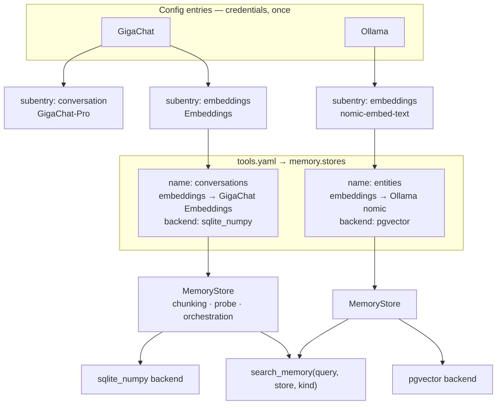

# Vector Backends + Embedding Providers — Design Spec

- **Target version:** SmartChain v4.5.0 (MINOR with a BREAKING section)
- **Author:** dzerik (designed in collaboration with Claude Code)
- **Date:** 2026-08-23
- **Status:** Approved — ready for implementation plan
- **Supersedes:** the Chroma-only store introduced in [v4.3.0 RAG spec](2026-05-27-rag-memory-design.md)

## 1. Motivation

Two defects in the v4.3.0 memory subsystem, both structural.

**Credentials are declared twice.** A user who already authenticated GigaChat as a config entry must re-enter the same credentials in `tools.yaml` to use GigaChat embeddings. Providers expose chat and embedding models under one authentication — SmartChain models them as unrelated. Conversation agents get first-class treatment (config entry + subentries + model discovery + UI), embeddings get a hand-written YAML block.

**One hardcoded vector store.** `MemoryStore` is a concrete Chroma facade. Chroma fails to install on a large share of Home Assistant deployments — it needs native dependencies (sqlite ≥ 3.35, onnxruntime) that HA's pip step frequently cannot resolve. v4.4.1 had to remove it from `manifest.json` entirely, which means the feature ships disabled by default for everyone.

This spec fixes both: embeddings become a provider capability expressed as a subentry type, and the vector store becomes a pluggable backend with a zero-dependency default that works everywhere Home Assistant does.

## 2. Goals

- Embeddings become a second subentry type alongside `conversation`, reusing config-entry credentials.
- Provider capability matrix — the embeddings subentry is offered only where the provider supports it.
- Embedding models are discovered through the existing `async_fetch_models` path, filtered by purpose.
- Multiple named memory stores, each binding one embeddings subentry to one vector backend.
- Four vector backends behind one Protocol; `sqlite_numpy` is the default and requires no new dependency.
- `search_memory` and `smartchain.clear_memory` gain a `store` parameter.
- Memory works out of the box on any Home Assistant installation.

## 3. Non-goals

- Migrating existing Chroma data. Chroma is removed; the orphaned directory is documented, not converted.
- Keeping Chroma as a fifth backend.
- Vision as a declared capability. `analyze_image` keeps its current client lookup.
- Cross-store federated search. `search_memory` queries exactly one store per call.
- Per-store embedding-model hot-swap. Changing a store's embeddings subentry requires clearing that store.
- Automatic migration of the old flat `memory:` block. It raises an explicit error with instructions.

## 4. Architecture



### New files

| Path | Responsibility |
|---|---|
| `tools/memory/backends/__init__.py` | Re-exports + `create_backend()` factory |
| `tools/memory/backends/base.py` | `VectorBackend` Protocol, `VectorRecord`, `VectorHit`, `Filter` alias |
| `tools/memory/backends/sqlite_numpy.py` | Default backend — stdlib `sqlite3` + numpy cosine |
| `tools/memory/backends/sqlite_vec.py` | `sqlite-vec` extension backend |
| `tools/memory/backends/pgvector.py` | PostgreSQL + pgvector via `asyncpg` |
| `tools/memory/backends/qdrant.py` | Qdrant REST via HA's shared aiohttp session |
| `tools/memory/registry.py` | `MemoryRegistry` — owns the `name -> MemoryStore` map and per-store tasks |

### Modified files

| Path | Change |
|---|---|
| `tools/memory/store.py` | Chroma removed; delegates vector ops to a `VectorBackend`; owns the dimension probe |
| `tools/memory/config.py` | `MemoryConfig` → `StoreConfig` + `BackendConfig` + `MemorySettings` |
| `tools/memory/embeddings.py` | Builds from (entry, subentry) instead of reading credentials from YAML |
| `tools/memory/search_tool.py` | `store` parameter; flat filter; per-store descriptions in the tool schema |
| `tools/memory/ingest.py` | Routes conversation turns to every store with `ingest_conversation: true` |
| `tools/memory/retention.py` | One task per store |
| `tools/schema.py` | `memory:` becomes `memory.stores[]`; per-store `backend:` sub-schema |
| `tools/loader.py` | Parses the new shape into `MemorySettings` |
| `config_flow.py` | `EmbeddingsSubentryFlow`; capability-filtered `async_get_supported_subentry_types` |
| `client_util.py` | `PROVIDER_CAPABILITIES`; `supports()`; `purpose` filter in `async_fetch_models`; `is_embedding_model()` |
| `__init__.py` | `_build_memory` → builds the registry; `clear_memory` gains `store` |
| `const.py` | New constants (§11) |
| `manifest.json`, `pyproject.toml` | `chromadb` and `langchain-chroma` fully removed |

## 5. Part 1 — Embeddings as a provider capability

### 5.1. Capability matrix

```python
CAPABILITY_CHAT = "chat"
CAPABILITY_EMBEDDINGS = "embeddings"

PROVIDER_CAPABILITIES: dict[str, frozenset[str]] = {
    ID_GIGACHAT:   frozenset({CAPABILITY_CHAT, CAPABILITY_EMBEDDINGS}),
    ID_YANDEX_GPT: frozenset({CAPABILITY_CHAT, CAPABILITY_EMBEDDINGS}),
    ID_OPENAI:     frozenset({CAPABILITY_CHAT, CAPABILITY_EMBEDDINGS}),
    ID_OLLAMA:     frozenset({CAPABILITY_CHAT, CAPABILITY_EMBEDDINGS}),
    ID_DEEPSEEK:   frozenset({CAPABILITY_CHAT}),
    ID_ANTHROPIC:  frozenset({CAPABILITY_CHAT}),
}
```

DeepSeek exposes no embeddings endpoint; Anthropic directs users to Voyage. Neither offers the embeddings subentry in the UI.

### 5.2. Subentry registration

`async_get_supported_subentry_types` receives the config entry, so the returned map is filtered per provider:

```python
@classmethod
@callback
def async_get_supported_subentry_types(
    cls, config_entry: ConfigEntry
) -> dict[str, type[ConfigSubentryFlow]]:
    types: dict[str, type[ConfigSubentryFlow]] = {
        SUBENTRY_TYPE_CONVERSATION: ConversationSubentryFlow,
    }
    engine = config_entry.data.get(CONF_ENGINE) or ID_GIGACHAT
    if CAPABILITY_EMBEDDINGS in PROVIDER_CAPABILITIES.get(engine, frozenset()):
        types[SUBENTRY_TYPE_EMBEDDINGS] = EmbeddingsSubentryFlow
    return types
```

### 5.3. `EmbeddingsSubentryFlow`

A single-step flow, deliberately smaller than `ConversationSubentryFlow` — an embeddings binding has no prompt, no tools, no temperature:

| Field | Type | Notes |
|---|---|---|
| `model` | `SelectSelector` | Populated by `async_fetch_models(..., purpose="embeddings")` |
| `model_user` | `str` | Free-text override, wins over `model` when non-empty |

The subentry title is the reference key used from `tools.yaml`.

### 5.4. Model discovery by purpose

`async_fetch_models` gains `purpose: str = CAPABILITY_CHAT` and filters the same API response it already fetches:

| Provider | Embedding-model predicate |
|---|---|
| OpenAI | `id.startswith("text-embedding-")` |
| GigaChat | `id_.startswith("Embeddings")` |
| Ollama | `capabilities` from `POST /api/show` contains `"embedding"`; fallback heuristic: name matches `embed\|bge-\|gte-\|e5-\|minilm` |
| YandexGPT | Static list — `text-search-doc`, `text-search-query` |

For the four providers with a live model API, chat filtering is the complement of the embedding predicate — so the existing chat lists change only by dropping embedding models that were previously offered as chat models by mistake. YandexGPT has no list endpoint and keeps two independent static lists, one per purpose.

Ollama's `/api/show` requires one request per model. To avoid N requests on every form render, the classifier requests `/api/show` only for models whose name does **not** match the heuristic, and caches results for the lifetime of the config flow.

### 5.5. Client construction

```python
def create_embeddings_from_subentry(
    hass: HomeAssistant,
    entry: ConfigEntry,
    subentry: ConfigSubentry,
) -> EmbeddingsProvider: ...
```

The name parallels the existing `create_embeddings` in the same module rather than `get_client` in `client_util`, so both constructors in `embeddings.py` read alike.

Resolves `engine` from `entry.data`, credentials from `entry.data`, model from `subentry.data`. Returns the existing `_ExecutorBacked` wrapper — the timeout and executor-offload behaviour from v4.3.0 is unchanged. `EmbeddingsConfigError` is raised for an unsupported provider or a missing model.

## 6. Part 2 — Named memory stores

### 6.1. YAML shape

```yaml
memory:
  stores:
    - name: conversations
      description: "Past conversations with the user"
      embeddings: "GigaChat Embeddings"
      backend:
        type: sqlite_numpy
      retention_days: 90
      ingest_conversation: true
      ingest_logbook:
        enabled: false
        domains: [light, climate, lock]
        poll_interval_minutes: 60

    - name: entities
      description: "Home devices and sensors"
      embeddings: "Ollama nomic"
      backend:
        type: pgvector
        dsn: "!secret pg_dsn"
        table: smartchain_entities
      retention_days: 0
      ingest_conversation: false
```

`name` matches `^[a-z_][a-z0-9_]*$` and is unique within the list — it becomes an enum value in the `search_memory` tool schema. `description` is optional and is surfaced to the LLM so it can choose the right store. `embeddings` references a subentry by title. `retention_days: 0` disables the cleanup task for that store, carrying over the v4.3.0 semantics; the `entities` store above uses it because device inventory should not expire.

### 6.2. Reference resolution

Resolved at registry build time, not at YAML parse time — the loader has no access to config entries. `MemoryRegistry.build()` walks all SmartChain config entries, collects `{subentry.title: (entry, subentry)}` for every `embeddings` subentry, and resolves each store's reference against that map. Failure modes:

- Title not found → `LOGGER.error` naming the missing title and listing available ones; that store is skipped, others still build.
- Duplicate titles across entries → `LOGGER.error`; the store is skipped rather than binding an arbitrary one.

This mirrors how `ask_agent` already resolves sibling agents through `subentry.title`.

### 6.3. Registry

```python
class MemoryRegistry:
    stores: dict[str, MemoryStore]

    async def build(self, settings: MemorySettings) -> None: ...
    async def shutdown(self) -> None: ...
    def get(self, name: str | None) -> MemoryStore | None: ...
    def names(self) -> list[str]: ...
    def describe(self) -> list[tuple[str, str]]: ...   # (name, description) for the tool schema
```

`get(None)` returns the single store when exactly one is configured, otherwise `None` — this keeps the `store` parameter optional in the common single-store case.

Lives in `hass.data[DOMAIN]["memory"]`. It owns one `RetentionTask` and at most one `MemoryLogbookPoller` per store. `shutdown()` cancels every task, awaits them, and then calls `close()` on each backend so connection pools and file handles are released — the same cancel-then-await ordering the v4.4.0 review established for `MCPManager.stop()`. `_reload_registry` keeps the atomic build-then-swap ordering introduced by the v4.3.0 review: the new registry is built first, and only on success is the old one shut down and replaced.

### 6.4. Consumer changes

**`search_memory`** gains `store` in its schema. When more than one store is configured the parameter is required and its `enum` lists the names; the description embeds each store's `description` so the model can choose. Single-store installs keep the parameter optional.

**`smartchain.clear_memory`** gains an optional `store` field. Omitted means every store. The fired `smartchain_memory_cleared` event carries `{"deleted": <int>, "stores": [<names>]}`.

**Conversation ingest** fans out to every store with `ingest_conversation: true`, each as its own background task so one slow embeddings provider cannot delay another store.

**Retention and logbook polling** are per-store, driven by that store's own `retention_days` and `ingest_logbook` block.

## 7. Part 3 — Vector backends

### 7.1. Protocol

```python
Filter: TypeAlias = dict[str, str | int | float | bool]   # AND of equalities

@dataclass(frozen=True)
class VectorRecord:
    doc_id: str
    vector: list[float]
    text: str
    metadata: dict[str, Any]

@dataclass(frozen=True)
class VectorHit:
    doc_id: str
    text: str
    metadata: dict[str, Any]
    distance: float          # cosine distance; lower is closer

class VectorBackend(Protocol):
    name: str
    is_available: bool

    async def initialize(self, dim: int) -> None: ...
    async def upsert(self, records: list[VectorRecord]) -> None: ...
    async def query(
        self, vector: list[float], top_k: int, where: Filter | None
    ) -> list[VectorHit]: ...
    async def delete_older_than(self, cutoff_iso: str) -> int: ...
    async def delete_where(self, where: Filter | None) -> int: ...
    async def close(self) -> None: ...
```

`initialize(dim)` is separate from `__init__` because the embedding dimension is only known after an async probe.

`delete_older_than` and `delete_where` are Protocol methods rather than client-side scans so that SQL and Qdrant backends can express them natively. The v4.3.0 implementation fetched every row into Python to filter by timestamp; that is retained only inside `sqlite_numpy`, where it is a local operation.

### 7.2. Dimension probe

`MemoryStore.async_setup()`:

1. `dim = len(await self.embeddings.embed_query(MEMORY_DIM_PROBE_TEXT))`
2. `await self.backend.initialize(dim)`
3. The backend persists `dim` in its own metadata — a `_meta` table for the SQLite backends, a table comment for pgvector, the collection config for Qdrant.
4. On mismatch with a previously stored dimension: `LOGGER.error` naming both values, `is_available = False`, and guidance to run `smartchain.clear_memory` with that store's name followed by `smartchain.reload_tools`.

No silent re-indexing and no silent data loss.

### 7.3. Filter translation

The Chroma `$and` dialect is replaced by a flat dict interpreted as a conjunction of equalities. This covers every filter the codebase constructs (`kind`, `subentry_id`, `agent_id`).

| Backend | Translation |
|---|---|
| `sqlite_numpy`, `sqlite_vec` | `WHERE json_extract(metadata, '$.kind') = ?` |
| `pgvector` | `WHERE metadata->>'kind' = $1` |
| `qdrant` | `{"must": [{"key": "kind", "match": {"value": ...}}]}` |

`search_tool.py` stops building `{"$and": [...]}` and passes the flat dict directly.

### 7.4. Backends

**`sqlite_numpy`** — the default; no new dependency. File at `<config>/.storage/smartchain_memory/<store_name>.db`. Schema: `docs(doc_id TEXT PRIMARY KEY, text TEXT, metadata TEXT, embedding BLOB, timestamp TEXT)` plus `_meta(key TEXT PRIMARY KEY, value TEXT)`. Vectors are stored as `numpy.float32().tobytes()`.

Query path: apply the metadata filter in SQL first to narrow the candidate set, then `numpy.frombuffer` the surviving embeddings into a matrix, compute cosine similarity as a normalised dot product, and select the top K with `argpartition`. Every `sqlite3` call goes through `hass.async_add_executor_job`.

Scale: 10 000 vectors at 768 dimensions is ~30 MB per query and single-digit milliseconds. The documented soft limit is ~50 000 records per store, beyond which pgvector or Qdrant is recommended. Exceeding it logs a one-time warning rather than failing.

**`sqlite_vec`** — same file layout, but a `vec0` virtual table with the extension's native KNN. Requires `conn.enable_load_extension`, which some Python builds compile out. When unavailable, `initialize` logs a clear error naming `sqlite_numpy` as the drop-in alternative and sets `is_available = False`.

**`pgvector`** — an `asyncpg` pool built from the configured DSN. `CREATE EXTENSION IF NOT EXISTS vector` needs elevated privileges and is documented as a prerequisite. Table: `<table>(doc_id text PRIMARY KEY, text text, metadata jsonb, embedding vector(N), timestamp timestamptz)`. Index: HNSW with `vector_cosine_ops`, degrading to no index with a logged warning if the server's pgvector predates HNSW support. Query: `ORDER BY embedding <=> $1 LIMIT $2` with the jsonb filter in `WHERE`.

**`qdrant`** — REST over `async_get_clientsession(hass)`; no new dependency. Collection created with `{"vectors": {"size": N, "distance": "Cosine"}}`. Qdrant requires point IDs to be unsigned integers or UUIDs, while SmartChain document IDs are strings such as `logbook_<sha1>` or `<uuid>_chunk0`. The backend maps each with `uuid5(NAMESPACE_URL, doc_id)` — deterministic, so upserts stay idempotent — and keeps the original ID in the payload. `api_key` travels in the `api-key` header; `verify_ssl: false` is honoured through the same custom httpx/aiohttp connector pattern the MCP client uses.

## 8. Error handling and security

Two distinct failure classes:

- **Initialization failure** (bad DSN, missing extension, unreachable Qdrant at build time) disables that store: `is_available = False`, every operation no-ops. Other stores are unaffected.
- **Runtime failure** (a transient network blip) is logged, the operation returns an empty result or zero, and the store stays available. A dropped Postgres connection must not disable memory until Home Assistant restarts.

`dsn`, `api_key` and any other credential never appear in strings returned to the LLM or in service-response errors — the boundary established in v4.0.2. Backend errors surface to the model as `"Memory lookup failed; see logs."`

`MEMORY_BACKEND_TIMEOUT_SECONDS = 30` bounds every backend operation, mirroring the existing embeddings timeout.

## 9. Breaking changes and migration

**Chroma is removed.** `chromadb` and `langchain-chroma` disappear from the manifest and from the codebase. Existing `.storage/smartchain_memory/` directories are orphaned; the CHANGELOG instructs users to delete them. No data is converted — in practice the directory is empty for the great majority of installs, because `chromadb` could not be installed by HA's pip step.

**The `memory:` block changes shape.** The v4.3.0 form carried `provider`, `model`, `api_key` at the top level. Credentials no longer live in YAML at all, so automatic migration is impossible: there is no subentry to point at until the user creates one. Detecting the old shape raises a `LoaderError` whose message spells out the three steps — create an embeddings subentry, replace the block with a `stores:` list, call `smartchain.reload_tools`.

## 10. Tests

The central piece is a **conformance suite**: one parametrised test class exercising the full `VectorBackend` contract, run against every backend, so the Protocol cannot drift between implementations. `sqlite_numpy` runs for real; `sqlite_vec` is `skipif`-guarded on extension availability; `pgvector` runs against a mocked `asyncpg`; `qdrant` runs against a mocked aiohttp session, following the MCP SSE test pattern.

| File | Coverage |
|---|---|
| `test_memory_backend_conformance.py` | Parametrised contract suite across all four backends |
| `test_memory_backend_sqlite_numpy.py` | Real SQLite; cosine correctness, chunk round-trip, soft-limit warning |
| `test_memory_backend_sqlite_vec.py` | Extension present and absent paths |
| `test_memory_backend_pgvector.py` | DDL, HNSW fallback, jsonb filter translation |
| `test_memory_backend_qdrant.py` | Collection creation, `uuid5` id mapping, filter translation, api-key header |
| `test_memory_dimension_probe.py` | Probe, persistence, mismatch detection and guidance |
| `test_memory_filter_translation.py` | Flat filter → each dialect |
| `test_provider_capabilities.py` | Capability matrix; embeddings subentry hidden for DeepSeek and Anthropic |
| `test_embeddings_model_discovery.py` | `purpose` filtering per provider; Ollama `/api/show` fallback and caching |
| `test_embeddings_subentry_flow.py` | `EmbeddingsSubentryFlow` happy path and custom-model override |
| `test_memory_registry.py` | Reference resolution, missing and duplicate titles, atomic rebuild, shutdown |
| `test_memory_multi_store.py` | Per-store ingest routing, retention, `store` parameter in tool and service |

Existing memory tests are updated for the new shapes: `test_memory_store.py` drops the Chroma fake in favour of a real `sqlite_numpy`, and `_schema` / `_loader` / `_search_tool` / `_clear_service` follow the new config and parameters.

Target: 289 → approximately 345.

## 11. Constants

```python
SUBENTRY_TYPE_EMBEDDINGS = "embeddings"
CAPABILITY_CHAT = "chat"
CAPABILITY_EMBEDDINGS = "embeddings"

MEMORY_BACKEND_TYPES = ["sqlite_numpy", "sqlite_vec", "pgvector", "qdrant"]
MEMORY_DEFAULT_BACKEND = "sqlite_numpy"
MEMORY_BACKEND_TIMEOUT_SECONDS = 30
MEMORY_DIM_PROBE_TEXT = "smartchain dimension probe"
MEMORY_STORE_NAME_PATTERN = r"^[a-z_][a-z0-9_]*$"
MEMORY_SQLITE_SOFT_LIMIT = 50_000
MEMORY_DEFAULT_QDRANT_COLLECTION = "smartchain_memory"
MEMORY_DEFAULT_PG_TABLE = "smartchain_memory"
```

## 12. Implementation order

The plan is sequenced so that a mid-cycle stop still leaves `main` green and shippable.

1. **Backends first.** The Protocol and all four implementations are self-contained inside `tools/memory/backends/`. `MemoryStore` switches from Chroma to a backend while the YAML shape stays as it is in v4.4.2. At the end of this phase memory works out of the box on `sqlite_numpy` — a shippable improvement on its own.
2. **Embeddings as a capability.** Capability matrix, purpose-filtered discovery, `EmbeddingsSubentryFlow`, `create_embeddings_from_subentry`. Nothing consumes it yet.
3. **Multi-store.** `MemorySettings`, `MemoryRegistry`, the new YAML shape, `store` parameters, per-store tasks. This is the step that rewrites the config plumbing, and it happens exactly once.

The old flat `memory:` block stays valid through phases 1 and 2 — those phases change how vectors are stored and add an unused capability, neither of which touches the YAML contract. The breaking change and the `LoaderError` described in §9 land in phase 3, together with the version bump.

## 13. Risks and mitigations

| Risk | Mitigation |
|---|---|
| numpy backend degrades on large stores | SQL filter narrows candidates before the numpy stage; soft limit documented with a one-time warning; pgvector and Qdrant are the documented upgrades |
| `sqlite-vec` cannot load in some Python builds | Detected at `initialize`; error names `sqlite_numpy` as the drop-in replacement; the default never depends on it |
| pgvector server lacks HNSW | Index creation degrades to none with a logged warning; queries still work, just without an index |
| Ollama `/api/show` costs N requests | Only queried for names the heuristic does not already classify; cached for the config-flow lifetime |
| Embeddings subentry deleted while a store references it | Registry rebuild skips that store with a logged error; other stores keep working |
| Store's embedding model changed in place | Dimension mismatch is detected at probe time and reported with exact remediation steps |
| Cycle is large (~22 tasks) | Three-phase order with a green checkpoint after phase 1 |

## 14. Deferred follow-ups

- Cross-store federated search in a single `search_memory` call.
- Automatic re-embedding when a store's embeddings subentry changes.
- Additional backends — Milvus, Weaviate, Redis, Elasticsearch.
- Vision as a declared provider capability.
- Managing stores and embeddings subentries from the SmartChain panel — subsystem **D** of the roadmap.
- Entity indexing that consumes a dedicated store — subsystem **B**.
