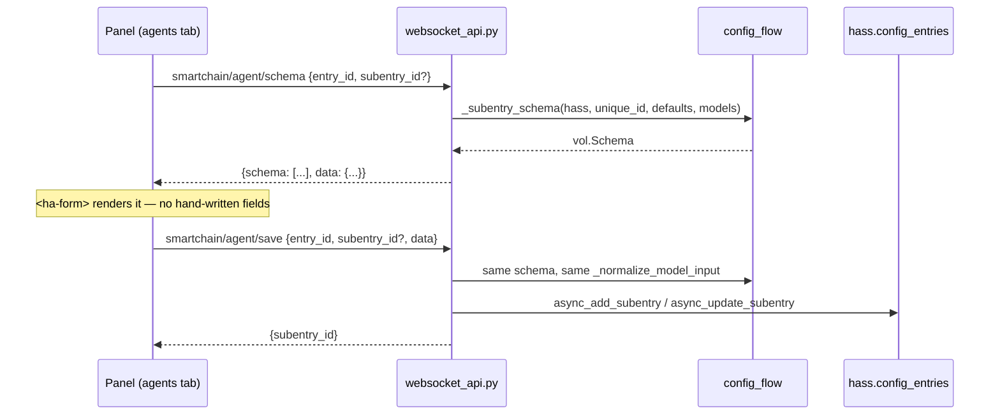

# Panel configuration, part 1: agents — design

**Date:** 2026-08-24
**Status:** approved, ready for planning
**Release:** part of v5.0.0 (roadmap subsystem **D**, first of three plans)

---

## 1. Goal

Give the SmartChain panel a websocket API and a tabbed shell, and make agents —
the `conversation` subentries — fully manageable from it: listed, created,
edited, duplicated and deleted, without leaving the panel.

Home Assistant already offers this under Settings → Devices & Services. The
panel's justification is not parity but the overview it can give that a flow
dialog cannot: every agent on one screen with its provider, model and tool
count, and one-click duplication of an agent that took effort to tune.

## 2. Scope

Subsystem D is three plans. This spec covers only the first.

**In scope (D1).** A websocket API module; the panel shell with tabs; the agents
tab with list, create, edit, duplicate and delete; form rendering driven by the
config flow's own schema.

**Out of scope, by plan.** **D2**: entry settings (today's
`OptionsFlow.async_step_settings`) and embeddings subentries. **D3**:
`tools.yaml`, read-only — view, syntax check and a reload button, with no file
writing (see §10).

**Not in scope at all.** Removing or replacing Home Assistant's own config
pages. They remain the canonical path; the panel is an additional surface. This
is deliberate — a bug in the panel must not lock the user out of their own
integration.

## 3. Architecture

Three pieces, and one idea holding them together.



**The idea: the panel never defines a form.** The backend serialises the very
`vol.Schema` the config flow builds, using `voluptuous_serialize.convert` — the
same function Home Assistant uses to send flow schemas to its own frontend — and
the panel renders it with `<ha-form>`, Home Assistant's own form element.

This matters more than convenience. A hand-written panel form would put the
field list in two places, and the two would drift the first time a field was
added. The v5.0.0 provider work hit that exact defect twice, where one table
field was read two ways in two consumers. Here the schema is physically single.

Validation follows the same rule: the save handler runs the serialized schema
against the submitted data and reuses `_normalize_model_input`, rather than
restating any check.

## 4. The websocket commands

New module `custom_components/smartchain/websocket_api.py`, registered from
`async_setup`. Every command is `@websocket_api.require_admin`.

| Command | Input | Returns |
|---|---|---|
| `smartchain/overview` | — | entries and their agents (§4.1) |
| `smartchain/agent/schema` | `entry_id`, `subentry_id?` | serialized schema + current values |
| `smartchain/agent/save` | `entry_id`, `subentry_id?`, `data` | `{subentry_id}` |
| `smartchain/agent/duplicate` | `entry_id`, `subentry_id` | `{subentry_id}` |
| `smartchain/agent/delete` | `entry_id`, `subentry_id` | `{}` |

`save` creates when `subentry_id` is absent and updates when present — one
command, because the panel's form is the same in both cases and the flow's own
create and reconfigure steps already differ only in that.

### 4.1 What `overview` returns, and what it must never return

Per entry: `entry_id`, `title`, `engine` id and label, and whether the provider
supports embeddings. Per agent subentry: `subentry_id`, `title`, the resolved
model, and the number of tools it may use.

**It must never return `entry.data[CONF_API_KEY]`, `CONF_FOLDER_ID`, or any
other credential.** The subentries themselves hold no credentials — those live
on the entry — so the rule is simply that entry data is never forwarded
wholesale. A response is assembled field by field from an explicit list.

This is a requirement rather than a caution: v4.0.2 shipped a fix for provider
keys leaking into error responses, and this API's surface is wider than that one
was.

### 4.2 Errors

A command that fails returns a websocket error with a stable code —
`not_found`, `invalid_data`, `unknown` — and a message safe to display. A
validation failure returns the per-field errors `<ha-form>` can display, in the
shape `{field_name: error_key}` that Home Assistant's own flow responses use.

**No error message may contain a credential or a raw provider response body.**

## 5. Model lists

Both flows call `async_fetch_models` on every open, which reaches the provider
over the network. In a flow dialog that cost is paid once. In a panel where the
user moves between agents it would be paid constantly.

So `smartchain/agent/schema` takes an optional `refresh: bool` (default
`false`). Without it the handler uses the models already cached for that entry;
with it, it re-fetches. The panel offers this as the refresh control beside the
model field.

The cache lives in `hass.data[DOMAIN]`, keyed by entry id and purpose, with no
expiry — an explicit refresh is the invalidation. A provider's model list
changing while the panel is open is not a problem worth a timer.

## 6. Panel structure

The panel today is 424 lines of plain custom elements across four files, with no
build step and no Lit. D1 keeps that: `<ha-form>` is used as a plain element,
and no dependency is added.

```
panel/
  smartchain-panel.js      shell: tab bar, routing between tabs
  services.js              + websocket helpers alongside the service ones
  styles.js                + styles for the list and form layout
  components/
    camera-tab.js          unchanged
    agents-tab.js          new — list, actions, form
    agent-form.js          new — wraps <ha-form> and the save/cancel actions
```

The shell gains a tab bar and shows one tab at a time. The camera tab moves
under it unchanged; the panel's existing behaviour must be reachable in exactly
one more click and no fewer.

## 7. What changes in existing code

Deliberately little.

- `config_flow.py` gains nothing and loses nothing behavioural. One extraction:
  the agent title expression `model_user or model or "Agent"`, currently written
  twice in `ConversationSubentryFlow`, becomes a module-level helper that the
  flow and the websocket handler both call. A third copy in the new module is
  how titles would start to diverge.
- `__init__.py` registers the websocket commands in `async_setup`, beside the
  services and the panel registration.
- `_subentry_schema` and `_normalize_model_input` are called from the new
  module. They are private by name; D1 makes them cross-module, so they lose the
  underscore, exactly as `compatible_api_key` did in the provider work.

## 8. The one real risk, and how the plan retires it

`<ha-form>` is a Home Assistant frontend element. It is used widely by custom
cards, and `voluptuous_serialize` is verified present and working in this
environment. But **whether `<ha-form>` renders this integration's serialized
schema correctly inside a custom panel has not been proven**, and it cannot be
proven from the backend.

Every part of this design depends on it. So the plan's **first task is a
vertical slice**: one websocket command returning one serialized schema, and a
panel that renders it and logs the submitted value. Nothing else. If `<ha-form>`
does not work, we learn it in task 1 with a day's work behind us, not in task 8.

**Fallback if it does not work:** the panel renders the same serialized schema
with hand-written inputs — a `renderField(spec)` switch over the `type` values
`voluptuous_serialize` emits (`string`, `float`, `boolean`, `select`). The
schema stays single-source; only the rendering is ours. This is a worse outcome,
not a failed one, and the spec's other decisions are unaffected.

## 9. Testing

The backend is testable in the usual way; the panel is not, and the plan should
not pretend otherwise.

- **Websocket commands**: one test per command for the success path, using
  `hass_ws_client`. Create, update, duplicate and delete each verified by
  reading `entry.subentries` afterwards, not by trusting the response.
- **Authorisation**: every command rejects a non-admin user. One test per
  command, since `require_admin` is a decorator that is easy to omit on one.
- **Credential containment**: a test that asserts the full `overview` response,
  serialised to JSON, contains neither the configured API key's value nor the
  folder id. This must fail if entry data is ever forwarded wholesale.
- **Schema parity**: a test asserting the field names the websocket command
  serialises are exactly the field names `_subentry_schema` produces — the
  guard that keeps the single source single.
- **Validation parity**: input the flow rejects must be rejected by `save` with
  the same error key.
- **Duplication**: the copy has different `subentry_id`, a distinct title, and
  identical data otherwise.
- **The panel**: no automated tests. The plan states what to click and what to
  see for each task, and task 1's slice is verified by hand before the rest is
  built on it.

## 10. Deferred, with reasons

- **D2 and D3**, as §2 describes.
- **Writing `tools.yaml` from the panel.** D3 is read-only: view, syntax check,
  reload. Writing YAML from a browser breaks the integration on any mistake, and
  the file carries `!secret` references that an editor would either expose or
  overwrite. Read-only delivers most of the value at a fraction of the risk;
  editing can be a considered step afterwards.
- **Creating a config entry (a new provider connection) from the panel.** That
  is the one flow with credentials in it, and Home Assistant's own dialog
  handles it well. The panel links to it.
- **Reordering agents, or grouping them.** No storage exists for an order.
