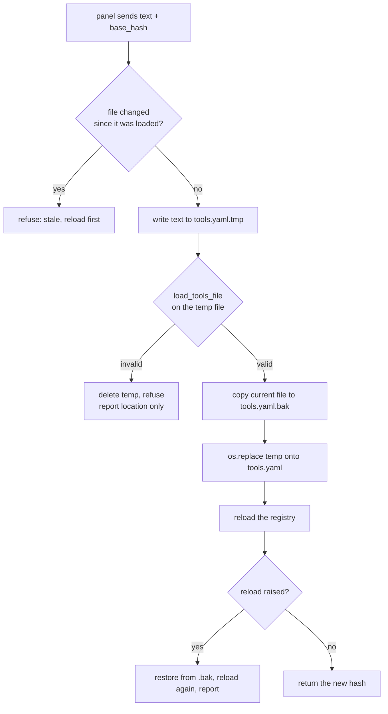

# Editing tools.yaml from the panel — design

**Date:** 2026-08-25
**Status:** approved, ready for planning
**Follows:** `2026-08-25-panel-config-d2-d3-design.md` §6, which made this view read-only

---

## 1. Goal

Let the Tools tab edit `tools.yaml`, not just display it: a text editor, a
validity check before anything is written, a backup, and a rollback.

## 2. Why this was read-only, and what changes

D3 refused to write the file for two reasons. One of them is now the design's
foundation rather than an obstacle; the other still binds.

**Resolved: the `!secret` round trip.** The worry was that a form would show a
resolved credential and write the value back in place of the reference. That
only happens if the file passes through the parser. **This editor edits raw
text and stores raw text** — the bytes the user sees are the bytes on disk, and
`!secret openai_key` stays a reference because nothing ever resolves it on the
way in or out. This is not a mitigation bolted on; it is why the feature is
shaped as a text editor rather than a form.

**Still binding: a wrong keystroke disables everything.** A malformed file takes
out every custom tool, every MCP server and the memory subsystem at once. So the
integration never writes a file it has not first proved loadable, and always
leaves a way back.

## 3. The write path

Four steps, in this order, and the order is the safety argument:



**Validation happens on a temp file, not in memory**, because `load_tools_file`
takes a path and resolves `!secret` against the config directory — the same
loader the integration uses at startup, so what passes here is what will load
later. Anything else would be a second, weaker validator.

**`os.replace` is atomic**, so a crash mid-write cannot leave a truncated file.
Writing in place could.

**The reload can still fail** even when the file validates — an MCP server that
will not start, an embeddings binding that no longer resolves. That is why the
rollback path exists inside the save handler and not only as a user action: the
user asked to save a file, not to lose their tools.

## 4. Concurrency

`tools/get` returns a `hash` of the text it served. `tools/save` requires that
hash back and refuses if the file on disk no longer matches — the user may also
edit through a file editor, SSH, or a second browser tab.

Refusing is the whole behaviour. No merging, no last-write-wins: the panel tells
the user the file changed underneath them and offers to reload it. Silently
overwriting someone's edit is the failure this prevents, and it is cheap.

## 5. Commands

| Command | Input | Returns |
|---|---|---|
| `smartchain/tools/get` | — | `{text, path, exists, error?, hash}` — `hash` is new |
| `smartchain/tools/save` | `text`, `base_hash` | `{ok, hash}` or a refusal with a reason |
| `smartchain/tools/rollback` | — | `{ok, hash}` — restores `.bak` |

`validate` and `reload` stay as they are. All admin-only, like the other
thirteen.

**Refusal reasons are distinct and machine-readable**, because the panel must
respond differently to each: `stale` (reload and retry), `invalid` (fix the
YAML, and here is where), `write_failed` (permissions, disk), `reload_failed`
(the file was valid but the integration could not adopt it — restored).

## 6. What an error may say

Unchanged from D3 and worth restating, because writing widens the surface:
`load_tools_file` raises through voluptuous, whose messages embed the offending
value, and Home Assistant's YAML loader resolves `!secret` **on mapping keys as
well as values** — a review proved a secret reaching `err.path` this way.

So a validation refusal reports the **exception type only**, as
`_safe_loader_error` already does. A YAML *syntax* error is different: it comes
from the parser, not the schema, and the parser fails before any `!secret` is
resolved.

**Verified against the installed loader rather than assumed.** A file with a
`!secret` reference and a broken flow sequence produced:

```
tools.yaml parse error: while parsing a flow sequence
  in ".../smartchain/tools.yaml", line 9, column 26
expected ',' or ']', but got '<stream end>'
```

— line and column present, the secret's value absent. The absolute path appears,
which is not new disclosure: `tools/get` already returns it.

**The discriminator is the cause's type, never the message text.** A parse
failure arrives with a `HomeAssistantError` (or a `yaml.YAMLError`) as
`__cause__`; a schema failure arrives with `vol.Invalid` / `MultipleInvalid`.

Whitelist the safe case, do not blacklist the unsafe one: forward the message
**only** when the cause is a known parse-error type, and fall back to the type
name for everything else, including causes nobody anticipated. A blacklist
inverts the failure mode — an unfamiliar exception would be forwarded rather
than withheld — and this codebase has already shipped one leak that came from
exactly the class of error nobody enumerated.

## 7. The editor

The Tools tab gains a `<textarea>`, monospace, with Validate, Save and Rollback.
Deliberately plain: no syntax highlighting, no bracket matching, no third-party
editor component. The panel has no build step and adding one for this would cost
more than it returns.

- **Validate** checks without writing. Available at any time.
- **Save** is disabled until the text differs from what was loaded.
- **Rollback** is offered only when a backup exists, and confirms first — it
  discards whatever is currently on disk.
- A stale refusal offers to reload, and says plainly that reloading discards the
  user's unsaved edit.

## 8. Testing

- **`!secret` survives a round trip**: load a file containing a reference, save
  it back unchanged, and assert the bytes on disk are identical and the
  reference is still a reference. This is the property the whole shape exists to
  protect.
- **An invalid file is never written**: save malformed YAML, assert the original
  file is byte-identical afterwards and no temp file is left behind.
- **A stale hash is refused**, and the file is untouched.
- **The backup is taken before the replace**, and rollback restores exactly.
- **A failing reload restores the previous file** — simulate by making the
  reload raise, then assert the file and the registry are as they were.
- **No refusal carries a resolved secret**, including the syntax-error path with
  its line and column.
- **The directory is created** when `/config/smartchain/` does not exist, which
  is the state on a fresh install.

## 9. Deferred

- Form-based editing of individual tools. Worth revisiting for `service` and
  `script` actions, where there is no embedded code; `template` and `rest`
  bodies are code and a form for them degrades into a worse text box.
- Versioned history beyond one backup.
- Editing `secrets.yaml`. Out of scope permanently: it holds the credentials in
  plain text, and nothing in this integration should read it back to a browser.
